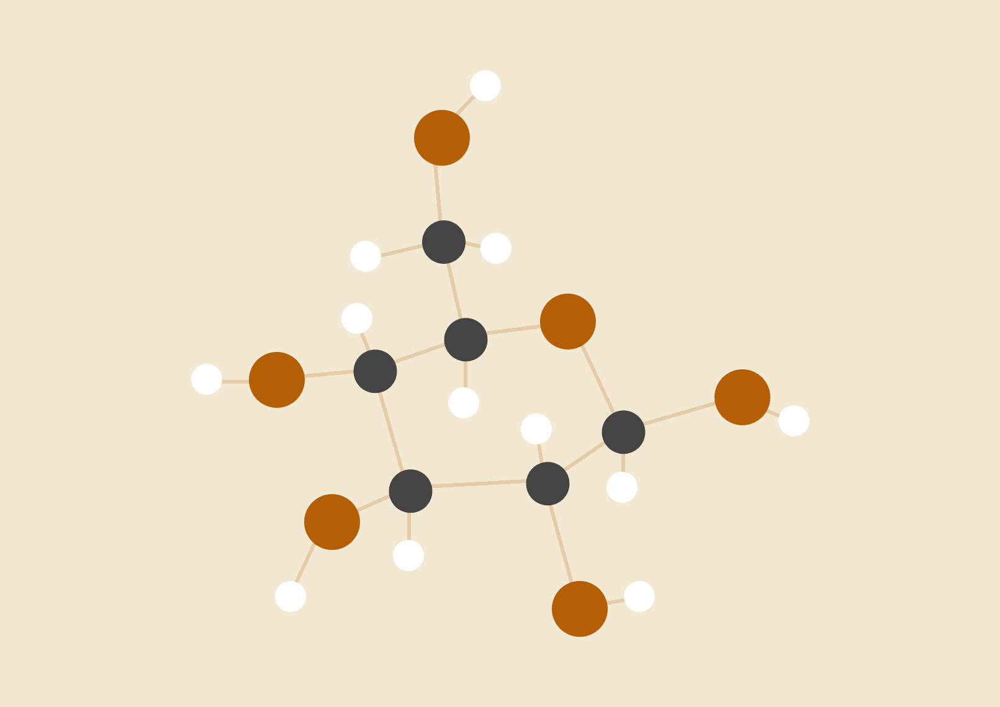
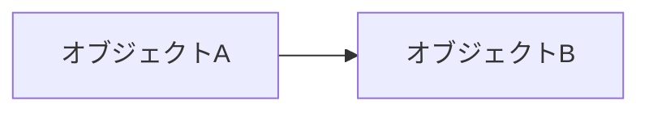

# ペットの名前

*私の大切な友だち*

<table>
  <tr>
    <td width="40%" valign="top">
      
    </td>
    <td width="60%" valign="top">
      
年齢: 4 歳

      
性別: オス

      
体重: 15 kg

      
品種: 雑種

    </td>
  </tr>
</table>

## 性格

ここにテキストを挿入 ここにテキストを挿入 ここにテキストを挿入 ここにテキストを挿入 ここにテキストを挿入 ここにテキストを挿入 ここにテキストを挿入 ここにテキストを挿入 ここにテキストを挿入 ここにテキストを挿入。

ここにテキストを挿入 ここにテキストを挿入 ここにテキストを挿入。

## 健康とグルーミング

ここにテキストを挿入 ここにテキストを挿入 ここにテキストを挿入 ここにテキストを挿入 ここにテキストを挿入 ここにテキストを挿入 ここにテキストを挿入 ここにテキストを挿入 ここにテキストを挿入 ここにテキストを挿入 ここにテキストを挿入 ここにテキストを挿入 ここにテキストを挿入 ここにテキストを挿入。

ここにテキストを挿入 ここにテキストを挿入 ここにテキストを挿入 ここにテキストを挿入 ここにテキストを挿入。

## オーナーについて

ここにテキストを挿入 ここにテキストを挿入 ここにテキストを挿入 ここにテキストを挿入 ここにテキストを挿入 ここにテキストを挿入 ここにテキストを挿入 ここにテキストを挿入 ここにテキストを挿入 ここにテキストを挿入 ここにテキストを挿入 ここにテキストを挿入 ここにテキストを挿入。

