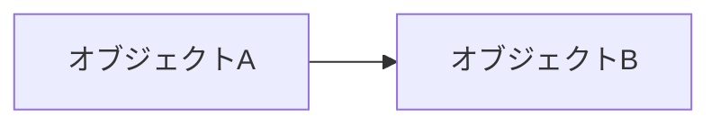

# ペットの名前

*私の大切な友だち*

年齢: 4 歳
性別: オス
体重: 15 kg
品種: 雑種

## 性格

ここにテキストを挿入 ここにテキストを挿入 ここにテキストを挿入 ここにテキストを挿入 ここにテキストを挿入 ここにテキストを挿入 ここにテキストを挿入 ここにテキストを挿入 ここにテキストを挿入 ここにテキストを挿入。

ここにテキストを挿入 ここにテキストを挿入 ここにテキストを挿入。

## 健康とグルーミング

ここにテキストを挿入 ここにテキストを挿入 ここにテキストを挿入 ここにテキストを挿入 ここにテキストを挿入 ここにテキストを挿入 ここにテキストを挿入 ここにテキストを挿入 ここにテキストを挿入 ここにテキストを挿入 ここにテキストを挿入 ここにテキストを挿入 ここにテキストを挿入 ここにテキストを挿入。

ここにテキストを挿入 ここにテキストを挿入 ここにテキストを挿入 ここにテキストを挿入 ここにテキストを挿入。

## オーナーについて

ここにテキストを挿入 ここにテキストを挿入 ここにテキストを挿入 ここにテキストを挿入 ここにテキストを挿入 ここにテキストを挿入 ここにテキストを挿入 ここにテキストを挿入 ここにテキストを挿入 ここにテキストを挿入 ここにテキストを挿入 ここにテキストを挿入 ここにテキストを挿入。

