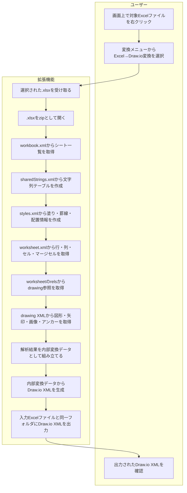

# F01 Excel→Draw.io変換機能 機能設計書

## 1. 概要

本機能は、Excel `.xlsx` ファイルを解析し、Draw.io / diagrams.net で確認・補正可能な `.drawio` XML へ変換する。

変換処理では、Excelの解析結果を内部データ構造として保持し、その内容からDraw.io XMLを生成する。
内部データは処理上の一時情報であり、通常はファイルとして出力しない。

```text
Excel .xlsx
  → 内部変換データ
  → Draw.io XML
```

## 2. 変換表

| 項目           | 方針                                                                                                                        |
| -------------- | --------------------------------------------------------------------------------------------------------------------------- |
| Excel解析方式  | `.xlsx` を zip / Open XML として直接解析する                                                                              |
| HTML経由変換   | 採用しない。図形・座標・画像の再現が不安定なため                                                                            |
| 内部変換データ | JSON相当の構造                                                                                                              |
| Draw.io出力    | `mxfile` XML                                                                                                              |
| シート         | Excelの各シートをDraw.ioの各diagramページに変換する                                                                         |
| 表             | HTML tableラベル方式を基本とする                                                                                            |
| 通常セル       | 値またはスタイルがあるセルのみ変換対象                                                                                      |
| 空白セル       | 値もスタイルもない通常セルは出力しない                                                                                      |
| 図形           | Draw.io vertexへ変換する                                                                                                    |
| 矢印           | Draw.io edgeへ変換する                                                                                                      |
| 画像           | base64 data URIとしてDraw.io XMLへ埋め込む<br />※Draw.ioはローカル相対パス画像を表示できないため、外部画像参照は採用しない |


## 3. 対象範囲

### 3.1 対象

- `.xlsx` 形式のExcelブック
- 複数シート
- セル文字列、数値
- セル背景色、罫線
- 行高、列幅
- マージセル
- Excel図形
- Excel矢印、コネクタ
- Excel画像

### 3.2 対象外

- `.xls` 旧形式
- パスワード付きExcel
- マクロ実行
- 数式の再計算
- グラフの編集可能オブジェクト化
- SmartArtの完全再現
- ピボットテーブルの再構築
- Excelと完全一致するページ印刷レイアウト

対象外要素は、可能な場合は画像化または無視し、変換ログや警告として扱う。

## 4. 入出力

### 4.1 入力

| 入力          | 内容                  |
| ------------- | --------------------- |
| Excelファイル | `.xlsx`             |
| 出力先        | Draw.io XMLの出力パス |

### 4.2 出力

| 出力        | 内容                        |
| ----------- | --------------------------- |
| Draw.io XML | diagrams.netで開くためのXML |

Draw.io XMLの拡張子は `.drawio` または `.dio.xml` を想定する。

## 5. 全体処理フロー



## 6. Open XML解析

### 6.1 主な解析対象

| Open XMLファイル                        | 用途                                  |
| --------------------------------------- | ------------------------------------- |
| `xl/workbook.xml`                     | シート名、シートID                    |
| `xl/_rels/workbook.xml.rels`          | workbookからworksheetへの参照         |
| `xl/worksheets/sheet*.xml`            | セル、行、列、マージセル、drawing参照 |
| `xl/worksheets/_rels/sheet*.xml.rels` | worksheetからdrawingへの参照          |
| `xl/sharedStrings.xml`                | 共有文字列                            |
| `xl/styles.xml`                       | セルスタイル                          |
| `xl/drawings/drawing*.xml`            | 図形、矢印、画像、座標                |
| `xl/drawings/_rels/drawing*.xml.rels` | drawingから画像ファイルへの参照       |
| `xl/media/*`                          | 画像バイナリ                          |

### 6.2 セル値

Excelの文字列セルは、多くの場合 `sharedStrings.xml` のインデックスとして保存される。
変換時は `sharedStrings.xml` を先に読み、`cells[].value` には表示文字列を格納する。

例:

| Excel内部値 | 出力値  |
| ----------- | ------- |
| `1`       | `1`   |
| `1.0`     | `1.0`   |
| `1.5`     | `1.5` |

## 7. 内部変換データ設計

内部変換データは、ExcelのOpen XMLから取得した情報をDraw.io XML生成に使いやすい形へ整理したメモリ上のデータ構造である。
ファイルとしては出力しない。

### 7.1 全体項目

| 項目 | 内容 |
|---|---|
| `workbook` | Excelブック全体の情報 |
| `sheets` | Excelシートごとの解析結果配列 |

### 7.2 workbook

| 項目 | 内容 |
|---|---|
| `source` | 入力Excelファイルパス |
| `format` | 解析方式。`.xlsx` をzip / Open XMLとして扱うため `xlsx-zip` を設定する |
| `sheets_count` | 解析対象シート数 |

### 7.3 sheets[]

| 項目 | 内容 |
|---|---|
| `name` | Excelシート名。Draw.ioの `diagram.name` に使用する |
| `sheet_id` | workbook.xml上のシートID |
| `path` | zip内のworksheet XMLパス |
| `rows` | 行情報。行番号、行高を保持する |
| `cols` | 列情報。列番号範囲、列幅を保持する |
| `cells` | セル情報。セル番地、値、型、スタイル参照を保持する |
| `styles` | セルスタイル情報。背景色、罫線、フォント、配置などを保持する |
| `merged_cells` | セル結合情報。HTML tableの `colspan` / `rowspan` 変換に使用する |
| `drawings` | 図形、矢印、画像などのDrawingML解析結果 |
| `images` | ブック内画像リソース情報 |
| `anchors` | DrawingMLのアンカー情報。図形や画像の配置計算に使用する |

### 7.4 rows[]

| 項目 | 内容 |
|---|---|
| `index` | Excel行番号 |
| `height` | 行高。未設定の場合はデフォルト行高を使用する |

### 7.5 cols[]

| 項目 | 内容 |
|---|---|
| `min` | 列範囲の開始列番号 |
| `max` | 列範囲の終了列番号 |
| `width` | Excel列幅 |
| `custom_width` | Excel上で列幅が明示設定されているか |

### 7.6 cells[]

| 項目 | 内容 |
|---|---|
| `ref` | Excelセル番地。例: `B17` |
| `row` | 行番号 |
| `col` | 列番号 |
| `style_id` | `styles` への参照ID |
| `type` | Excelセル型。例: `s` は共有文字列、`n` は数値 |
| `raw_value` | worksheet XML上の元値 |
| `value` | sharedStringsや数値整形を反映した表示用の値 |

### 7.7 styles[]

| 項目 | 内容 |
|---|---|
| `style_id` | セルスタイルID |
| `font_id` | フォント定義ID |
| `fill_id` | 塗り定義ID |
| `fill_color` | 背景色。Draw.ioの表CSSまたは `fillColor` に使用する |
| `border_id` | 罫線定義ID |
| `border_color` | 罫線色。Draw.ioの表CSSまたは `strokeColor` に使用する |
| `num_fmt_id` | 数値書式ID |
| `apply_border` | 罫線が適用されているか |
| `apply_alignment` | 配置情報が適用されているか |

### 7.8 drawings[]

| 項目 | 内容 |
|---|---|
| `id` | DrawingML上の図形ID |
| `name` | DrawingML上の図形名 |
| `kind` | Draw.io変換種別。`vertex`、`edge`、`image` のいずれか |
| `preset` | Excel図形種別。例: `flowChartAlternateProcess` |
| `text` | 図形内テキスト |
| `fill` | 図形塗り色 |
| `stroke` | 線色 |
| `sourceId` | 矢印の接続元図形ID |
| `targetId` | 矢印の接続先図形ID |
| `path` | 画像の場合のzip内画像パス |
| `data_uri` | 画像の場合のbase64 data URI |
| `x` | Draw.io出力用X座標 |
| `y` | Draw.io出力用Y座標 |
| `width` | Draw.io出力用幅 |
| `height` | Draw.io出力用高さ |

### 7.9 ルート構造例

以下は内部変換データの構造例である。

ファイル出力は行わず、Draw.io XML生成処理へそのまま渡す。

```json
{
  "workbook": {
    "source": "input.xlsx",
    "format": "xlsx-zip",
    "sheets_count": 2
  },
  "sheets": []
}
```

### 7.10 sheet例

```json
{
  "name": "シート1",
  "sheet_id": "1",
  "path": "xl/worksheets/sheet1.xml",
  "rows": [],
  "cols": [],
  "cells": [],
  "styles": [],
  "merged_cells": [],
  "drawings": [],
  "images": [],
  "anchors": []
}
```

### 7.11 cell例

```json
{
  "ref": "B17",
  "row": 17,
  "col": 2,
  "style_id": 3,
  "type": "s",
  "raw_value": "12",
  "value": "no"
}
```

### 7.12 style例

```json
{
  "style_id": 3,
  "font_id": 0,
  "fill_id": 2,
  "fill_color": "#CFE2F3",
  "border_id": 1,
  "border_color": "#000000",
  "num_fmt_id": 0,
  "apply_border": true,
  "apply_alignment": true
}
```

### 7.13 drawing例

図形:

```json
{
  "id": "3",
  "name": "Shape 3",
  "kind": "vertex",
  "preset": "flowChartAlternateProcess",
  "text": "オブジェクトA",
  "fill": "#CFE2F3",
  "stroke": "#000000",
  "x": 135,
  "y": 106,
  "width": 263.28,
  "height": 213.13
}
```

矢印:

```json
{
  "id": "4",
  "kind": "edge",
  "preset": "straightConnector1",
  "stroke": "#000000",
  "sourceId": "3",
  "targetId": "5"
}
```

画像:

```json
{
  "id": "pic-1",
  "kind": "image",
  "path": "xl/media/image1.png",
  "x": 100,
  "y": 100,
  "width": 120,
  "height": 80,
  "data_uri": "data:image/png,..."
}
```

## 8. Draw.io変換設計

### 8.1 mxfile構造

Excelの各シートをDraw.ioのdiagramページに変換する。

```xml
<mxfile host="app.diagrams.net">
  <diagram id="POC-1" name="シート1">
    <mxGraphModel>
      <root>
        <mxCell id="0"/>
        <mxCell id="1" parent="0"/>
      </root>
    </mxGraphModel>
  </diagram>
</mxfile>
```

### 8.2 シート名

- Draw.ioの `diagram.name` にExcelシート名を設定する。
- シート内にはシートタイトル用のmxCellを出力しない。

### 8.3 座標

Excel DrawingMLの座標はEMUで保存される。
Draw.ioではpx相当の値で扱うため、以下で変換する。

```text
px = emu / 914400 * 96
```

セル座標は列幅・行高をpxへ近似変換し、累積値から求める。

| Excel                               | Draw.io        |
| ----------------------------------- | -------------- |
| 行高pt                              | px             |
| 列幅                                | px近似         |
| DrawingML EMU                       | px             |
| `x`, `y`, `width`, `height` | `mxGeometry` |

### 8.4 表

表はHTML tableラベル方式を基本とする。

```xml
<mxCell
  id="table-B17-E20"
  value="<table ...>...</table>"
  style="html=1;whiteSpace=wrap;overflow=fill;rounded=0;fillColor=none;strokeColor=none;"
  vertex="1"
  parent="1">
  <mxGeometry x="133.41" y="376" width="710.48" height="84" as="geometry"/>
</mxCell>
```

採用理由:

- Draw.io上で表が1つのまとまりになる。
- XML要素数を抑えられる。
- 罫線、背景色、文字寄せ、列幅、行高をHTML/CSSで表現しやすい。
- セル結合を `colspan` / `rowspan` で表現できる。

制約:

- Draw.io上でセル単位のオブジェクト編集はしづらい。
- HTMLレンダリング仕様に依存する。

### 8.5 通常セル

表として判定されないセルは、Draw.ioのtextセルとして出力する。

```xml
<mxCell
  id="cell-A1"
  value="サンプルテスト"
  style="text;html=1;fillColor=none;strokeColor=none;align=center;verticalAlign=middle;fontSize=11;"
  vertex="1"
  parent="1">
  <mxGeometry x="40" y="40" width="93.41" height="21" as="geometry"/>
</mxCell>
```

値もスタイルもない通常セルは出力しない。

### 8.6 図形

Excel図形はDraw.io vertexへ変換する。

```xml
<mxCell
  id="shape-3"
  value="オブジェクトA"
  style="rounded=1;arcSize=12;whiteSpace=wrap;html=1;fillColor=#CFE2F3;strokeColor=#000000;"
  vertex="1"
  parent="1">
  <mxGeometry x="135" y="106" width="263.28" height="213.13" as="geometry"/>
</mxCell>
```

対応方針:

| Excel DrawingML               | Draw.io                  |
| ----------------------------- | ------------------------ |
| `xdr:sp`                    | vertex                   |
| 図形テキスト                  | `mxCell.value`         |
| 塗り色                        | `fillColor`            |
| 線色                          | `strokeColor`          |
| `flowChartAlternateProcess` | `rounded=1;arcSize=12` |

### 8.7 矢印

ExcelコネクタはDraw.io edgeへ変換する。

```xml
<mxCell
  id="edge-4"
  value=""
  style="edgeStyle=orthogonalEdgeStyle;rounded=0;html=1;strokeColor=#000000;endArrow=classic;"
  edge="1"
  parent="1"
  source="shape-3"
  target="shape-5">
  <mxGeometry relative="1" as="geometry"/>
</mxCell>
```

Excel側に開始・終了接続が明示されていない場合は、近傍のvertexから接続元・接続先を推定する。

### 8.8 画像

画像はbase64 data URIとしてDraw.io XMLへ埋め込む。

```xml
<mxCell
  id="image-pic-1"
  value=""
  style="shape=image;html=1;imageAspect=0;aspect=fixed;image=data:image/png,...;"
  vertex="1"
  parent="1">
  <mxGeometry x="100" y="100" width="120" height="80" as="geometry"/>
</mxCell>
```

採用理由:

- Draw.ioファイル単体で画像を表示できる。
- `resources/image.png` のような相対パスはDraw.ioで `Invalid image source` になる。
- GitHubの通常URLやローカルファイルパスでは表示が安定しない。
- 外部URL方式は公開URLやHTTPサーバーが必要になり、運用が複雑になる。

## 9. 変換ルール一覧

| 入力       | 内部変換データ                      | Draw.io                            |
| ---------- | ----------------------------------- | ---------------------------------- |
| シート名   | `sheets[].name`                   | `diagram.name`                   |
| セル値     | `cells[].value`                   | textセルまたはHTML table内テキスト |
| 表範囲     | `cells`, `styles`               | HTML tableラベル                   |
| 背景色     | `styles[].fill_color`             | `background` / `fillColor`     |
| 罫線       | `styles[].border_color`           | `border` / `strokeColor`       |
| 行高       | `rows[].height`                   | `mxGeometry.height` / CSS height |
| 列幅       | `cols[].width`                    | `mxGeometry.width` / CSS width   |
| マージセル | `merged_cells`                    | `colspan` / `rowspan`          |
| 図形       | `drawings[kind=vertex]`           | vertex                             |
| 矢印       | `drawings[kind=edge]`             | edge                               |
| 画像       | `drawings[kind=image]`            | `shape=image` + base64           |
| 座標       | `x`, `y`, `width`, `height` | `mxGeometry`                     |

## 10. 表判定

表は以下のいずれかに該当するセル集合として判定する。

- 罫線が適用されている。
- 背景色が適用されている。
- 隣接セルが連続し、表範囲を形成している。

判定後、上下左右に隣接する表セルを連結成分としてまとめ、1つのHTML tableとして出力する。

## 11. エラー・例外処理

今後、Word、PowerPoint変換機能でも同様の取り扱いが必要になるため、Officeファイル共通のエラーとExcel固有のエラーを分けて扱う。

### 11.1 Office共通

| 事象                              | 処理                                                                     |
| --------------------------------- | ------------------------------------------------------------------------ |
| 入力ファイルが存在しない          | エラー終了                                                               |
| Officeファイルとして開けない      | エラー終了                                                               |
| zip / Open XMLとして展開できない  | エラー終了                                                               |
| 暗号化、パスワード保護されている  | エラー終了                                                               |
| 必須XMLが存在しない               | エラー終了                                                               |
| relationshipsの参照先が存在しない | 該当要素をスキップし、警告として扱う                                     |
| 画像参照が解決できない            | 画像をスキップし、警告として扱う                                         |
| 未対応図形、未対応オブジェクト    | 可能ならテキストまたは画像として出力。不可ならスキップし、警告として扱う |
| 変換中に一部要素で例外が発生した  | ファイル全体を止めず、該当要素をスキップできる場合は警告として継続する   |
| Draw.io XML生成に失敗した         | エラー終了                                                               |

### 11.2 Excel固有

| 事象                                     | 処理                                         |
| ---------------------------------------- | -------------------------------------------- |
| `.xlsx` として必要なworkbook構造がない | エラー終了                                   |
| `sharedStrings.xml` がない             | 空配列として扱う                             |
| `styles.xml` がない                    | デフォルトスタイルとして扱う                 |
| drawing参照がない                        | セルのみ変換する                             |
| worksheetが存在しない                    | 該当シートをスキップし、警告として扱う       |
| 接続先不明の矢印                         | 近傍vertexから推定。推定不可ならedgeのみ出力 |

## 12. 制約

- Excelの表示と完全一致することは保証しない。
- 行高・列幅は近似値である。
- 複雑な図形、SmartArt、グラフは完全再現しない。
- Draw.io上で表セル単位の編集性は限定的である。
- base64画像によりDraw.io XMLのファイルサイズは増加する。
