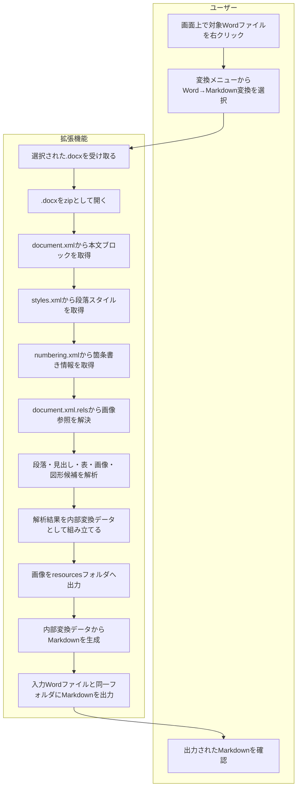

# F02 Word→Markdown変換機能 機能設計書

## 1. 概要

本機能は、Word `.docx` ファイルを解析し、AIと人間が読みやすいMarkdownへ変換する。

変換処理では、Wordの解析結果を内部データ構造として保持し、その内容からMarkdownを生成する。
内部データは処理上の一時情報であり、通常はファイルとして出力しない。

```text
Word .docx
  → 内部変換データ
  → Markdown
```

## 2. 変換表

| 項目 | 方針 |
|---|---|
| Word解析方式 | `.docx` を zip / Open XML として直接解析する |
| 内部変換データ | JSON相当の構造 |
| Markdown出力 | `.md` |
| 画面入力 | 画面上で対象Wordファイルを右クリックし、変換対象として選択する |
| 出力先 | 入力Wordファイルと同一フォルダ |
| 見出し | Markdown見出しへ変換する |
| 段落 | Markdown本文へ変換する |
| 箇条書き | Markdown listへ変換する |
| 表 | Markdown tableへ変換する |
| 画像 | `resources/` 配下へ外部ファイルとして出力し、Markdownから相対参照する |
| Word図形 | Markdownで完全再現しづらいため、画像フォールバックまたはMermaid候補として扱う |
| HTML tableレイアウト | Markdownとして読みづらいため、基本採用しない |

## 3. 対象範囲

### 3.1 対象

- `.docx` 形式のWord文書
- 見出し
- 段落
- 改行
- 箇条書き
- 表
- 画像
- 単純なWord図形テキスト
- 単純なフロー図のMermaid候補化

### 3.2 対象外

- `.doc` 旧形式
- パスワード付きWord
- マクロ実行
- Wordの完全なページレイアウト再現
- ヘッダー、フッターの完全再現
- 脚注、文末脚注の完全再現
- SmartArt、複雑図形の完全再現
- テキストボックス、図形、画像の重なり順の完全再現

対象外要素は、取得できる情報に応じて画像化、テキスト抽出、Mermaid候補化の順に扱う。
いずれの形式にも変換できない場合は警告として扱い、Markdown本文には出力しない。

## 4. 入出力

### 4.1 入力

| 入力 | 内容 |
|---|---|
| Wordファイル | `.docx` |
| ファイル選択方法 | 画面上で対象Wordファイルを右クリックし、変換メニューから選択する |

### 4.2 出力

| 出力 | 内容 |
|---|---|
| Markdown | 変換後の本文 |
| resourcesフォルダ | Markdownから参照する画像ファイル |
| 出力先 | 入力Wordファイルと同一フォルダ |

出力ファイル名は入力Wordファイル名を基準にする。

例:

| 入力 | 出力 |
|---|---|
| `/path/to/レポート.docx` | `/path/to/レポート.md` |
| `/path/to/レポート.docx` 内の画像 | `/path/to/resources/image1.png` |

## 5. 全体処理フロー



## 6. Open XML解析

### 6.1 主な解析対象

| Open XMLファイル | 用途 |
|---|---|
| `word/document.xml` | 本文、段落、表、画像参照、図形 |
| `word/_rels/document.xml.rels` | documentから画像などへの参照 |
| `word/styles.xml` | 段落スタイル、見出しスタイル |
| `word/numbering.xml` | 箇条書き、番号付きリスト |
| `word/media/*` | 画像バイナリ |
| `word/header*.xml` | ヘッダー。初期対応では対象外または警告 |
| `word/footer*.xml` | フッター。初期対応では対象外または警告 |

### 6.2 本文ブロック

`word/document.xml` の `w:body` 配下を順に解析し、Markdownの出力順を決定する。

| Word要素 | 内部変換データ | Markdown |
|---|---|---|
| `w:p` | paragraph | 見出しまたは本文 |
| `w:tbl` | table | Markdown table |
| `w:drawing` | image / shape候補 | Markdown画像、Mermaid候補、または警告 |

## 7. 内部変換データ設計

内部変換データは、WordのOpen XMLから取得した情報をMarkdown生成に使いやすい形へ整理したメモリ上のデータ構造である。
ファイルとしては出力しない。

### 7.1 全体項目

| 項目 | 内容 |
|---|---|
| `document` | Word文書全体の情報 |
| `blocks` | 本文順に並ぶブロック配列 |
| `images` | 文書内画像の一覧 |
| `shapes` | Word図形やテキストボックスの候補一覧 |

### 7.2 document

| 項目 | 内容 |
|---|---|
| `source` | 入力Wordファイルパス |
| `format` | 解析方式。`.docx` をzip / Open XMLとして扱うため `docx-zip` を設定する |

### 7.3 blocks[]

| 項目 | 内容 |
|---|---|
| `type` | ブロック種別。`paragraph`、`table` など |
| `index` | Word本文内の出現順 |
| `style` | Word段落スタイル。例: `Title`, `Subtitle`, `Heading1`, `Normal` |
| `text` | 段落テキスト |
| `drawings` | 段落内の画像、図形候補 |
| `rows` | 表ブロックの場合の行データ |

### 7.4 images[]

| 項目 | 内容 |
|---|---|
| `type` | `image` |
| `name` | Word内の画像名 |
| `description` | 画像説明文。存在する場合のみ |
| `source` | zip内画像パス |
| `path` | Markdownから参照する相対パス |
| `width_px` | 画像幅px |
| `height_px` | 画像高さpx |

### 7.5 shapes[]

| 項目 | 内容 |
|---|---|
| `type` | `shape_text` |
| `text` | 図形内テキスト |
| `labels` | Mermaid候補化に使うラベル配列 |
| `mermaid_candidate` | Mermaid化できる場合の候補コード |

### 7.6 内部変換データ例

```json
{
  "document": {
    "source": "input.docx",
    "format": "docx-zip"
  },
  "blocks": [
    {
      "type": "paragraph",
      "index": 0,
      "style": "Title",
      "text": "ペットの名前",
      "drawings": []
    }
  ],
  "images": [],
  "shapes": []
}
```

## 8. Markdown変換設計

### 8.1 見出し

Word段落スタイルをMarkdown見出しへ変換する。

| Word style | Markdown |
|---|---|
| `Title` | `#` |
| `Heading1` | `##` |
| `Heading2` | `###` |
| `Heading3` | `####` |

### 8.2 段落

`Normal` など通常段落は、そのままMarkdown本文として出力する。
段落間には空行を入れる。

### 8.3 箇条書き

Wordのnumbering情報を解析し、Markdown listへ変換する。

| Word | Markdown |
|---|---|
| 箇条書き | `- item` |
| 番号付きリスト | `1. item` |

### 8.4 表

Word表はMarkdown tableへ変換する。

```md
| 項目 | 内容 |
|---|---|
| 名前 | スペアミント |
```

セル内改行は `<br>` として扱う。

### 8.5 画像

画像はbase64埋め込みではなく、`resources/` 配下へ外部ファイルとして出力する。
Markdownから相対パスで参照する。

```md

```

画像が1x1などのプレースホルダーと判断できる場合は、Markdownへ出力しない。

### 8.6 Word図形

Word図形はMarkdownで完全再現しづらいため、次の順で扱う。

1. 図形全体画像が取得できる場合はMarkdown画像として出力する。
2. 単純なフロー図として判断できる場合はMermaid候補を出力する。
3. どちらも難しい場合は図形内テキストを引用または警告として扱う。

Mermaid候補:


### 8.7 HTML tableレイアウト

画像横に説明文があるようなWordレイアウトでも、Markdown本文ではHTML tableによる左右レイアウトは基本採用しない。
Markdownの可読性を優先し、通常の画像参照と本文段落として出力する。

## 9. 変換ルール一覧

| 入力 | 内部変換データ | Markdown |
|---|---|---|
| 文書情報 | `document` | 出力ファイル名、処理ログ |
| 見出し | `blocks[type=paragraph].style` | `#`, `##`, `###` |
| 段落 | `blocks[type=paragraph].text` | 本文 |
| 改行 | 段落内テキスト | Markdown改行または段落区切り |
| 箇条書き | numbering情報 | Markdown list |
| 表 | `blocks[type=table].rows` | Markdown table |
| 画像 | `images[].path` | Markdown画像参照 |
| Word図形 | `shapes[]` | 画像、Mermaid候補、または警告 |

## 10. エラー・例外処理

今後、Excel、PowerPoint変換機能でも同様の取り扱いが必要になるため、Officeファイル共通のエラーとWord固有のエラーを分けて扱う。

### 10.1 Office共通

| 事象 | 処理 |
|---|---|
| 入力ファイルが存在しない | エラー終了 |
| Officeファイルとして開けない | エラー終了 |
| zip / Open XMLとして展開できない | エラー終了 |
| 暗号化、パスワード保護されている | エラー終了 |
| 必須XMLが存在しない | エラー終了 |
| relationshipsの参照先が存在しない | 該当要素をスキップし、警告として扱う |
| 画像参照が解決できない | 画像をスキップし、警告として扱う |
| 未対応図形、未対応オブジェクト | 画像、テキストの順に出力可否を判定する。どちらも取得できない場合はスキップし、警告として扱う |
| 変換中に一部要素で例外が発生した | ファイル全体を止めず、該当要素をスキップできる場合は警告として継続する |
| Markdown生成に失敗した | エラー終了 |

### 10.2 Word固有

| 事象 | 処理 |
|---|---|
| `.docx` として必要なdocument構造がない | エラー終了 |
| `styles.xml` がない | デフォルトスタイルとして扱う |
| `numbering.xml` がない | リストなしとして扱う |
| 表の列数が行ごとに異なる | 最大列数に合わせて空セル補完する |
| 画像が1x1プレースホルダー | Markdownへ出力しない |
| Mermaid化できない図形 | 図形内テキストを出力するか、警告として扱う |

## 11. 制約

- Wordの表示と完全一致することは保証しない。
- Markdownはページレイアウト、重なり順、座標表現に向かない。
- 複雑な図形、SmartArt、テキストボックスの完全再現はしない。
- 画像はMarkdown外部ファイルとして管理するため、Markdown単体では画像を内包しない。
- Mermaid化は単純なフロー図候補に限定する。
