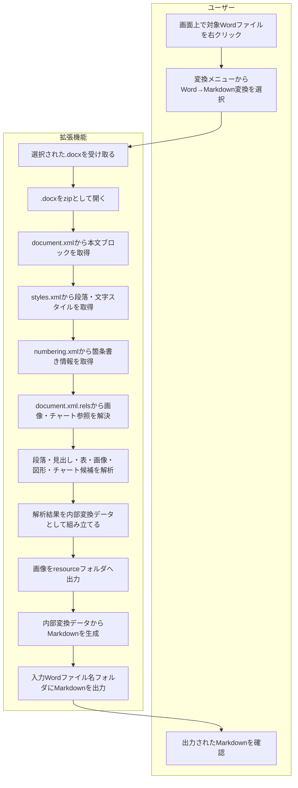
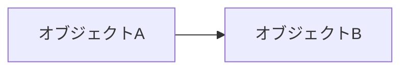
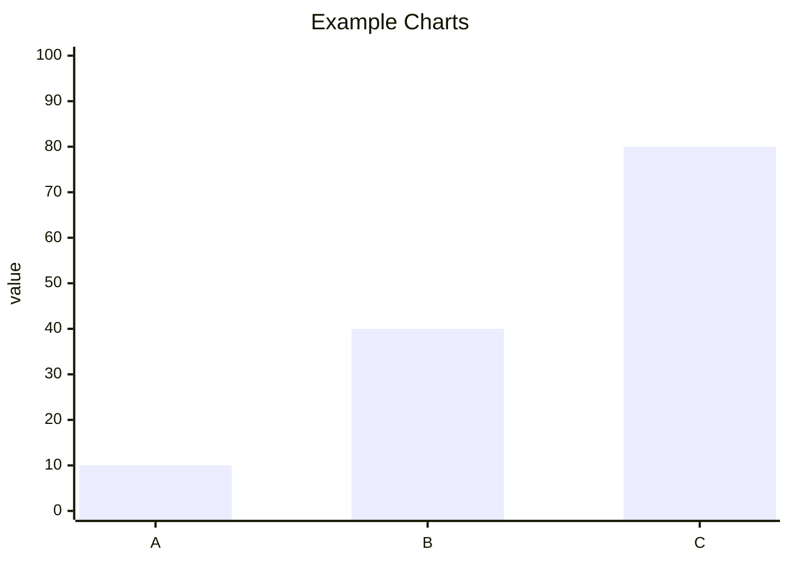
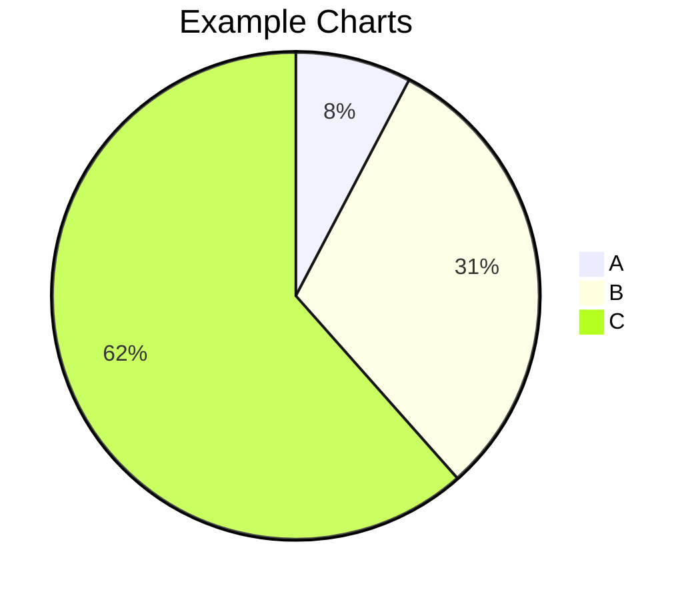

# F02 Word→Markdown変換機能 機能設計書

## 1. 概要

本機能は、Word `.docx` ファイルを解析し、AIと人間が読みやすいMarkdownへ変換する。

変換処理では、Wordの解析結果を内部データ構造として保持し、その内容からMarkdownを生成する。
内部データは処理上の一時情報であり、通常はファイルとして出力しない。

変換結果は、まずAIが文書構造、意味、表、チャート内容を理解しやすいことを優先する。
次に、人間がMarkdownとして視認、編集しやすいことを優先する。
Wordの見た目を完全再現することは目的とせず、意味を落とさない範囲でHTML混在Markdownを採用する。

```text
Word .docx
  → 内部変換データ
  → Markdown
```

## 2. 変換表

| 項目 | 方針 |
|---|---|
| Word解析方式 | `.docx` を zip / Open XML として直接解析する |
| 内部変換データ | JSON相当の構造 |
| Markdown出力 | `.md` |
| 画面入力 | 画面上で対象Wordファイルを右クリックし、変換対象として選択する |
| 出力先 | 入力Wordファイルと同一フォルダに入力Wordファイル名のフォルダを作成し、その配下へ出力する |
| 見出し | Markdown見出しへ変換する |
| 段落 | Markdown本文へ変換する。文字装飾、文字色、文字サイズ、配置はHTML混在Markdownで補足する |
| 箇条書き | `numbering.xml` を解析し、Markdown listへ変換する |
| 表 | Markdown tableへ変換する |
| 画像 | `<入力Wordファイル名>resource/` 配下へ外部ファイルとして出力し、Markdownから相対参照する |
| Word図形 | Markdownで完全再現しづらいため、Mermaid候補、構造化テキスト、画像フォールバックの順に扱う |
| チャート | AI理解を優先し、Mermaid変換を先に試みる。難しい場合はデータ表または説明テキストとして出力する |
| HTML tableレイアウト | Markdownとして読みづらいため、基本採用しない |

## 3. 対象範囲

### 3.1 対象

- `.docx` 形式のWord文書
- 見出し
- 段落
- 改行
- 箇条書き
- 表
- 画像
- チャート
- 単純なWord図形テキスト
- 単純なフロー図のMermaid候補化

### 3.2 対象外

- `.doc` 旧形式
- パスワード付きWord
- マクロ実行
- Wordの完全なページレイアウト再現
- ヘッダー、フッターの完全再現
- 脚注、文末脚注の完全再現
- SmartArt、複雑図形の完全再現
- テキストボックス、図形、画像の重なり順の完全再現

対象外要素は、取得できる情報に応じてMermaid候補化、構造化テキストまたはデータ表、画像化、テキスト抽出の順に扱う。
いずれの形式にも変換できない場合は警告として扱い、Markdown本文には出力しない。

## 4. 入出力

### 4.1 入力

| 入力 | 内容 |
|---|---|
| Wordファイル | `.docx` |
| ファイル選択方法 | 画面上で対象Wordファイルを右クリックし、変換メニューから選択する |

### 4.2 出力

| 出力 | 内容 |
|---|---|
| Markdown | 変換後の本文 |
| resourceフォルダ | Markdownから参照する画像ファイル |
| 出力先 | 入力Wordファイルと同一フォルダに作成した入力Wordファイル名フォルダ |

出力ファイル名は入力Wordファイル名を基準にする。

例:

| 入力 | 出力 |
|---|---|
| `/path/to/レポート.docx` | `/path/to/レポート/レポート.md` |
| `/path/to/レポート.docx` 内の画像 | `/path/to/レポート/レポートresource/image1.png` |

## 5. 全体処理フロー



## 6. Open XML解析

### 6.1 主な解析対象

| Open XMLファイル | 用途 |
|---|---|
| `word/document.xml` | 本文、段落、表、画像参照、図形 |
| `word/_rels/document.xml.rels` | documentから画像などへの参照 |
| `word/styles.xml` | 段落スタイル、見出しスタイル |
| `word/numbering.xml` | 箇条書き、番号付きリスト |
| `word/media/*` | 画像バイナリ |
| `word/charts/chart*.xml` | Wordチャートの構造、系列、カテゴリ、値 |
| `word/embeddings/*` | チャート元データの埋め込みブック。取得できる場合のみ利用する |
| `word/header*.xml` | ヘッダー。初期対応では対象外または警告 |
| `word/footer*.xml` | フッター。初期対応では対象外または警告 |

### 6.2 本文ブロック

`word/document.xml` の `w:body` 配下を順に解析し、Markdownの出力順を決定する。

| Word要素 | 内部変換データ | Markdown |
|---|---|---|
| `w:p` | paragraph | 見出しまたは本文 |
| `w:tbl` | table | Markdown table |
| `w:drawing` | image / shape候補 | Markdown画像、Mermaid候補、または警告 |
| `c:chart` | chart | Mermaid候補、データ表、または警告 |

## 7. 内部変換データ設計

内部変換データは、WordのOpen XMLから取得した情報をMarkdown生成に使いやすい形へ整理したメモリ上のデータ構造である。
ファイルとしては出力しない。

### 7.1 全体項目

| 項目 | 内容 |
|---|---|
| `document` | Word文書全体の情報 |
| `blocks` | 本文順に並ぶブロック配列 |
| `images` | 文書内画像の一覧 |
| `shapes` | Word図形やテキストボックスの候補一覧 |
| `charts` | Wordチャートの一覧 |

### 7.2 document

| 項目 | 内容 |
|---|---|
| `source` | 入力Wordファイルパス |
| `format` | 解析方式。`.docx` をzip / Open XMLとして扱う。現行実装では `docx` を設定する |

### 7.3 blocks[]

| 項目 | 内容 |
|---|---|
| `type` | ブロック種別。`paragraph`、`table` など |
| `index` | Word本文内の出現順 |
| `style` | Word段落スタイル。例: `Title`, `Subtitle`, `Heading1`, `Normal` |
| `text` | 段落テキスト |
| `runs` | 段落内の文字列と文字装飾の配列 |
| `paragraph_format` | 段落配置、インデントなど段落単位の装飾 |
| `numbering` | 箇条書き、番号付きリスト情報。リストではない場合は未設定 |
| `drawings` | 段落内の画像、図形候補 |
| `rows` | 表ブロックの場合の行データ |
| `chart` | チャートブロックの場合のチャート情報 |

### 7.4 images[]

| 項目 | 内容 |
|---|---|
| `type` | `image` |
| `doc_pr_id` | `wp:docPr` のID |
| `name` | `wp:docPr` の名前 |
| `description` | `wp:docPr` の説明文 |
| `relationship_id` | `document.xml.rels` の参照ID |
| `resource` | 画像リソース情報。`source`、`path`、`content_type_hint`、`width_px`、`height_px` を含む |
| `size` | DrawingML上の表示サイズ。`cx_emu`、`cy_emu`、`width_px`、`height_px` を含む |

段落内画像は `blocks[].drawings[]` と `images[]` の両方に保持する。
画像固有のファイル情報は `resource` 配下へ格納する。
`w:drawing/wp:extent` が取得できる場合は、EMU値とpx換算値を `size` として保持する。

### 7.5 shapes[]

| 項目 | 内容 |
|---|---|
| `type` | `shape_text` |
| `name` | `wp:docPr` の名前。存在する場合のみ |
| `description` | `wp:docPr` の説明文。存在する場合のみ |
| `text` | 図形内テキスト |
| `labels` | Mermaid候補化に使うラベル配列 |
| `mermaid_candidate` | Mermaid化できる場合の候補コード |

### 7.6 charts[]

| 項目 | 内容 |
|---|---|
| `type` | `chart` |
| `chart_type` | `bar`、`line`、`pie`、`area`、`scatter` など |
| `title` | チャートタイトル。存在する場合のみ |
| `categories` | 横軸または分類ラベル |
| `series` | 系列名と値の配列 |
| `mermaid_candidate` | Mermaid化できる場合の候補コード |
| `data_table` | Mermaid化できない場合に出力する表データ |
| `source` | zip内チャートXMLパス |
| `relationship_id` | `document.xml.rels` の参照ID |

`mermaid_candidate` は、Mermaid種別とコードを分けて保持する。

| 項目 | 内容 |
|---|---|
| `type` | `pie` または `xychart-beta` |
| `code` | Markdownへコードブロックとして出力するMermaid本文 |

### 7.7 numbering

Wordの `w:numPr` と `numbering.xml` からリスト情報を解決する。

| 項目 | 内容 |
|---|---|
| `numId` | Wordの番号定義ID |
| `ilvl` | リスト階層。Markdown出力時は階層ごとに2スペースを付与する |
| `format` | `bullet`、`decimal` などの番号形式 |
| `text` | 番号表示テンプレート。例: `%1.`、`・` |

### 7.8 文字装飾データ

段落内の文字装飾は、本文テキストを失わないようにrun単位で保持する。
Word側の装飾がスタイル継承で指定される場合は、段落スタイル、runスタイル、`w:rPr` の直接指定の順に重ねる。
同一装飾の連続runはMarkdown生成前に結合する。

| 項目 | 内容 |
|---|---|
| `text` | run内文字列 |
| `bold` | 太字 |
| `italic` | 斜体 |
| `underline` | 下線 |
| `color` | 文字色。RGB値が取得できる場合は `#RRGGBB` |
| `font_size_pt` | 文字サイズpt。`w:sz` は半ポイント値のため2で割る |
| `highlight` | ハイライト色 |
| `font` | フォント名。取得できる場合のみ |

### 7.9 conversion_notes

変換時の補足情報を `conversion_notes` として保持する。
出力Markdown本文には通常出力せず、デバッグや将来の変換ログに利用する。

### 7.10 内部変換データ例

```json
{
  "document": {
    "source": "input.docx",
    "format": "docx"
  },
  "blocks": [
    {
      "type": "paragraph",
      "index": 0,
      "style": "Title",
      "text": "ペットの名前",
      "paragraph_format": {
        "align": "center"
      },
      "runs": [
        {
          "text": "ペットの名前",
          "bold": true,
          "color": "#1F4E79",
          "font_size_pt": 18
        }
      ],
      "drawings": []
    }
  ],
  "images": [],
  "shapes": [],
  "charts": []
}
```

## 8. Markdown変換設計

### 8.1 見出し

Word段落スタイルをMarkdown見出しへ変換する。

| Word style | Markdown |
|---|---|
| `Title` | `#` |
| `Subtitle` | `*text*` |
| `Heading1` | `##` |
| `Heading2` | `###` |
| `Heading3` | `####` |

`Heading4` 以降も `HeadingN` の数値をもとにMarkdown見出しへ変換する。
Markdown見出しレベルは最大6とし、`Heading1` は `##`、`Heading5` 以降は `######` とする。

### 8.2 段落

`Normal` など通常段落は、そのままMarkdown本文として出力する。
段落間には空行を入れる。

文字装飾、文字色、文字サイズ、配置は、AIが意味を読み取りやすい本文を保ちながら、人間が視認しやすい範囲でHTML混在Markdownへ変換する。

### 8.3 テキストデザイン

テキストデザインは中程度対応とし、Wordの完全な見た目ではなく、文意や強調の理解に効く情報を優先して残す。

| Word要素 | Open XML | Markdown出力 | 備考 |
|---|---|---|---|
| 太字 | `w:rPr/w:b` | `**text**` | Markdown標準で表現する |
| 斜体 | `w:rPr/w:i` | `*text*` | Markdown標準で表現する |
| 下線 | `w:rPr/w:u` | `<u>text</u>` | Markdown標準にないためHTMLを使う |
| 文字色 | `w:rPr/w:color` | `<span style="color:#RRGGBB">text</span>` | `auto` は出力しない |
| 文字サイズ | `w:rPr/w:sz` | `<span style="font-size:12pt">text</span>` | `w:sz=24` は `12pt` |
| 文字色 + 文字サイズ | `w:color` + `w:sz` | `<span style="color:#RRGGBB; font-size:12pt">text</span>` | style属性に統合する |
| ハイライト | `w:rPr/w:highlight` | `<span style="background-color:yellow">text</span>` | 代表色のみ対応する |
| 中央揃え | `w:pPr/w:jc val=center` | `<p style="text-align:center">text</p>` | 段落全体に適用する |
| 右揃え | `w:pPr/w:jc val=right` | `<p style="text-align:right">text</p>` | 段落全体に適用する |
| 均等割付 | `w:pPr/w:jc val=both` | `<p style="text-align:justify">text</p>` | 近似表現とする |
| 均等割付 | `w:pPr/w:jc val=distribute` | `<p style="text-align:justify">text</p>` | 近似表現とする |
| 左揃え | `w:pPr/w:jc val=left` | 通常Markdown本文 | デフォルトのためHTML化しない |

複数装飾が同時に指定された場合は、外側をMarkdownの強調、内側をHTML `span` とする。
ただし、HTML内でMarkdownが効かないビューアがあるため、色やサイズを使うrunは `<strong>`、`<em>` などHTMLタグへ寄せてもよい。

例:

```md
<p style="text-align:center"><span style="color:#C00000; font-size:14pt">重要</span></p>
```

### 8.4 箇条書き

Wordのnumbering情報を解析し、Markdown listへ変換する。

| Word | Markdown |
|---|---|
| 箇条書き | `- item` |
| 記号付き箇条書き | `記号 item`。Word固有の代表記号は `-` に正規化する |
| 番号付きリスト | `1. item` |
| 入れ子リスト | 階層ごとに2スペースを付ける |

番号付きリストの `%1.` などのテンプレートは、Markdownとして扱いやすいよう `%数字` を `1` に置換する。

### 8.5 表

Word表はMarkdown tableへ変換する。

```md
| 項目 | 内容 |
|---|---|
| 名前 | スペアミント |
```

セル内改行は `<br>` として扱う。

### 8.6 画像

画像はbase64埋め込みではなく、`<入力Wordファイル名>resource/` 配下へ外部ファイルとして出力する。
Markdownから相対パスで参照する。

```md

```

DrawingML上の表示サイズが取得できる場合は、Markdown画像ではなくHTML `img` として幅と高さを付与する。

```md

```

画像が1x1などのプレースホルダーと判断できる場合は、Markdownへ出力しない。

### 8.7 Word図形

Word図形はMarkdownで完全再現しづらいため、次の順で扱う。

1. 単純なフロー図として判断できる場合はMermaid候補を出力する。
2. 図形内テキストを構造化できる場合は引用または箇条書きとして出力する。
3. 図形全体画像が取得できる場合はMarkdown画像として出力する。
4. どれも難しい場合は警告として扱う。

Mermaid候補:



### 8.8 チャート

チャートはAIが内容を理解しやすい形を優先し、画像より先に構造化変換を試みる。

| 優先度 | 出力形式 | 条件 | 出力例 |
|---:|---|---|---|
| 1 | Mermaid | チャート種類、カテゴリ、系列、値を取得でき、Mermaidで意味を表現できる | `xychart-beta`、`pie` |
| 2 | データ表 | Mermaid化できないが、カテゴリ、系列、値を取得できる | Markdown table |
| 3 | 説明テキスト | 一部メタ情報のみ取得できる | `> チャート: ...` |
| 4 | 警告 | 内容を取得できない | Markdown本文には出力しない |

棒グラフ、折れ線グラフ、面グラフは `xychart-beta` への変換を試みる。
散布図などMermaid化対象外のチャートはデータ表への変換を試みる。



円グラフは `pie` への変換を試みる。



Mermaid化できない場合は、AIが読み取りやすいようにチャート名、系列、カテゴリ、値を表として出力する。

```md
| chart | series | category | value |
|---|---|---|---:|
| Example Charts | 売上 | A | 10 |
| Example Charts | 売上 | B | 40 |
```

### 8.9 HTML tableレイアウト

画像横に説明文があるようなWordレイアウトでも、Markdown本文ではHTML tableによる左右レイアウトは基本採用しない。
Markdownの可読性を優先し、通常の画像参照と本文段落として出力する。

## 9. 変換ルール一覧

| 入力 | 内部変換データ | Markdown |
|---|---|---|
| 文書情報 | `document` | 出力ファイル名、処理ログ |
| 見出し | `blocks[type=paragraph].style` | `#`, `##`, `###` |
| 段落 | `blocks[type=paragraph].text` | 本文、必要に応じて `<p style="text-align:...">` |
| 文字装飾 | `blocks[type=paragraph].runs[]` | Markdown強調、`span`、`u` |
| 改行 | 段落内テキスト | Markdown改行または段落区切り |
| 箇条書き | numbering情報 | Markdown list |
| 表 | `blocks[type=table].rows` | Markdown table |
| 画像 | `blocks[].drawings[].resource.path` | Markdown画像参照またはHTML `img` |
| Word図形 | `shapes[]` | 画像、Mermaid候補、または警告 |
| チャート | `charts[]` | Mermaid、データ表、説明テキスト、または警告 |

## 10. エラー・例外処理

今後、Excel、PowerPoint変換機能でも同様の取り扱いが必要になるため、Officeファイル共通のエラーとWord固有のエラーを分けて扱う。

### 10.1 Office共通

| 事象 | 処理 |
|---|---|
| 入力ファイルが存在しない | エラー終了 |
| Officeファイルとして開けない | エラー終了 |
| zip / Open XMLとして展開できない | エラー終了 |
| 暗号化、パスワード保護されている | エラー終了 |
| 必須XMLが存在しない | エラー終了 |
| relationshipsの参照先が存在しない | 該当要素をスキップし、警告として扱う |
| 画像参照が解決できない | 画像をスキップし、警告として扱う |
| 未対応図形、未対応オブジェクト | 画像、テキストの順に出力可否を判定する。どちらも取得できない場合はスキップし、警告として扱う |
| 変換中に一部要素で例外が発生した | ファイル全体を止めず、該当要素をスキップできる場合は警告として継続する |
| Markdown生成に失敗した | エラー終了 |

### 10.2 Word固有

| 事象 | 処理 |
|---|---|
| `.docx` として必要なdocument構造がない | エラー終了 |
| `styles.xml` がない | デフォルトスタイルとして扱う |
| `numbering.xml` がない | リストなしとして扱う |
| 文字装飾が解決できない | 本文テキストを優先し、装飾なしで出力する |
| 表の列数が行ごとに異なる | 最大列数に合わせて空セル補完する |
| 画像が1x1プレースホルダー | Markdownへ出力しない |
| Mermaid化できない図形 | 図形内テキストを出力するか、警告として扱う |
| Mermaid化できないチャート | チャートデータ表を出力する。データも取得できない場合は警告として扱う |

## 11. 制約

- Wordの表示と完全一致することは保証しない。
- Markdownはページレイアウト、重なり順、座標表現に向かない。
- 複雑な図形、SmartArt、テキストボックスの完全再現はしない。
- 画像はMarkdown外部ファイルとして管理するため、Markdown単体では画像を内包しない。
- 図形のMermaid化は単純なフロー図候補に限定する。
- テキストデザインは色、サイズ、配置などの中程度対応に留める。
- チャートのMermaid化は、Mermaidで表現できるチャート種別とデータ構造に限定する。
