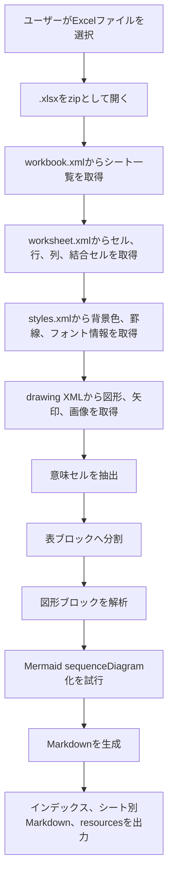
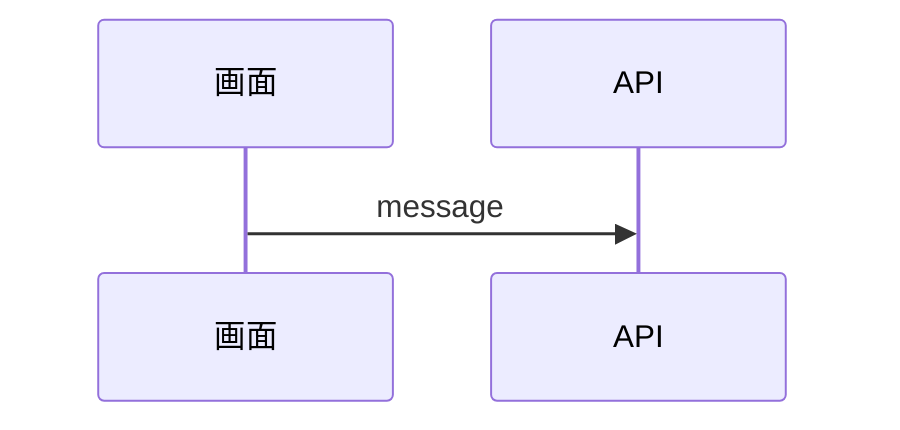

# F03 Excel→Markdown変換機能 機能設計書

## 1. 概要

本機能は、Excel `.xlsx` ファイルを解析し、AIが内容を理解しやすく、人間も編集しやすいMarkdownへ変換する。

Excelの表示領域、セル座標、列幅、行高を完全再現することは目的としない。
Markdownでは、Excelシート上の情報を「表」「図」「画像」の意味ブロックとして整理して出力する。

```text
Excel .xlsx
  → 内部変換データ
  → 意味ブロック抽出
  → Markdown
```

## 2. 変換方針

| 項目 | 方針 |
|---|---|
| 優先順位 | AIが内容を理解できること、人間が読みやすいこと、手修正しやすいこと、Git差分でレビューしやすいこと、元Excelに近い見た目の順に優先する |
| Excel解析方式 | `.xlsx` を zip / Open XML として直接解析する |
| 出力構成 | インデックスMarkdown + シート別Markdown + resources |
| セル | 意味セルのみ抽出する |
| 表 | 意味セルの連続ブロックごとにHTML tableを出力する |
| 空白行・空白列 | 表ブロック外周の空白行、空白列は削除する |
| 表内部の空白セル | 列位置、行位置を維持するため空欄セルとして残す |
| 図形 | Mermaid `sequenceDiagram` への変換を先に試みる |
| Mermaid化できない図 | 画像として取得できる場合は画像として出力する |
| 画像 | セル内へ無理に押し込まず、画像ブロックとして出力する |
| 出力順 | 表、図、画像を分類順ではなく、元シート上の上→下、左→右順で出力する |
| 見た目再現 | 列幅、行高、シート全体のグリッド再現はしない |

## 3. 対象範囲

### 3.1 対象

- `.xlsx` 形式のExcelブック
- 複数シート
- セル値
- 背景色、罫線など意味セル判定に使うスタイル
- セル結合
- Excel図形テキスト
- Excel矢印、コネクタ
- Excel画像
- 単純なシーケンス図のMermaid候補化

### 3.2 対象外

- `.xls` 旧形式
- パスワード付きExcel
- マクロ実行
- 数式の再計算
- ピボットテーブルの再構築
- Excel表示領域、印刷レイアウト、座標の完全再現
- 複雑な図形、SmartArt、グループ図形の完全再現
- Mermaid化できない図形をExcelレンダリング画像として生成する処理

## 4. 入出力

### 4.1 入力

| 入力 | 内容 |
|---|---|
| Excelファイル | `.xlsx` |
| ファイル選択方法 | 画面上で対象Excelファイルを右クリックし、変換メニューから選択する |

### 4.2 出力

入力Excelファイルと同一フォルダに、入力ファイル名のフォルダを作成する。

```text
入力:
  /path/to/sample.xlsx

出力:
  /path/to/sample/sample.md
  /path/to/sample/sheets/01_シート名.md
  /path/to/sample/resources/01_シート名-1.png
```

| 出力 | 内容 |
|---|---|
| インデックスMarkdown | ブック全体の目次。各シートMarkdownへのリンクを持つ |
| シート別Markdown | シートごとの表、図、画像を意味ブロックとして出力する |
| resources | Markdownから参照する画像ファイル |

## 5. 全体処理フロー



## 6. 意味セル抽出

Markdownへ出力する表は、シート全体のグリッドではなく、意味セルから作る。

### 6.1 意味セル

以下のいずれかを満たすセルを意味セルとする。

| 条件 | 用途 |
|---|---|
| 値が入っている | 本文情報として出力する |
| 背景色がある | 見出し、区切り、状態などの意味を持つ可能性がある |
| 罫線がある | 表構造を示す可能性がある |

ただし、値を持たない背景色のみ、罫線のみのセルは、単独ブロックとしては出力しない。
値セルを含む表ブロックの内部にある場合のみ、表構造維持のため空欄セルとして残す。

### 6.2 空白行・空白列

表ブロックの外周にある空白行、空白列は削除する。
表内部の空白セルは、行列関係を維持するため `<td></td>` として残す。

## 7. 表ブロック分割

シート全体を1つの表にはしない。
意味セルの連続性をもとに、複数の表ブロックへ分割する。

| 分割条件 | 内容 |
|---|---|
| 空白行 | 意味セルが存在しない行を境界とする |
| 空白列 | 意味セルが存在しない列を境界とする |
| 罫線、背景の連続性 | 隣接する意味セルの連結成分を表ブロックとする |

各表ブロックは `## Table 1`、`## Table 2` のように、シート上の位置順で出力する。

## 8. 表出力

HTML tableを基本とする。
ただし、Excelグリッド再現ではなく、意味ブロックとして必要な最小範囲のみ出力する。

```html
<table>
  <tr>
    <td>項目</td>
    <td>内容</td>
  </tr>
  <tr>
    <td>機能名</td>
    <td>ログイン</td>
  </tr>
</table>
```

出力するstyleは最小限にする。

| style | 方針 |
|---|---|
| `background` | 背景色がある場合のみ出力する |
| `border` | 罫線がある場合のみ出力する |
| `text-align` | 明示されている場合のみ出力する |
| `vertical-align` | 明示されている場合のみ出力する |
| `font-weight` | 太字の場合のみ出力する |
| `color` | 文字色がある場合のみ出力する |

列幅、行高、`colgroup` は出力しない。

## 9. 図形・シーケンス図

Excel図形とコネクタから、Mermaid `sequenceDiagram` への変換を試みる。

### 9.1 Mermaid化条件

| 条件 | 内容 |
|---|---|
| participant候補 | テキストを持つ図形をparticipant候補とする |
| message候補 | 始点、終点を推定できる矢印をmessage候補とする |
| 並び順 | 図形のX座標でparticipant順、矢印のY座標でmessage順を推定する |



### 9.2 Mermaid化できない場合

Mermaid化できない場合は、画像として取得できるものを画像ブロックとして出力する。
Excel図形そのものをレンダリング画像化する処理は対象外のため、取得済み画像がない図形はMarkdown本文には出力しない。

## 10. 画像

画像は `resources/` 配下へ外部ファイルとして出力し、シート別Markdownから相対参照する。

画像はセル位置へ押し込まず、`## Image 1`、`## Image 2` のような画像ブロックとして出力する。
Markdown上で小さくなりすぎないよう、表示幅は原則640pxを上限として指定する。

```md
## Image 1


```

## 11. Markdown生成順

シート別Markdownは以下の順で生成する。

```text
Excel sheet
  → 意味セル抽出
  → 空白行/列削除
  → 表ブロック分割
  → 図形ブロック解析
  → Mermaid化判定
  → Markdown生成
  → Mermaid化できない図は画像フォールバック
```

表、図、画像は、分類ごとにまとめず、元シート上の上→下、左→右順で並べる。
同じY位置にある場合はX位置が小さいブロックを先に出力する。

1. シート見出し
2. 位置順に並べた `## Table N`、`## Diagram N`、`## Image N`

## 12. 制約

- Excelの表示と完全一致することは保証しない。
- Markdownはセル座標、重なり順、表示領域の再現に向かない。
- 図形のMermaid化は単純なシーケンス図候補に限定する。
- Mermaid化できないExcel図形の画像フォールバックは、取得済み画像がある場合に限る。
- AIと人間にとってノイズになる空白セルや装飾だけの広大なグリッドは出力しない。
