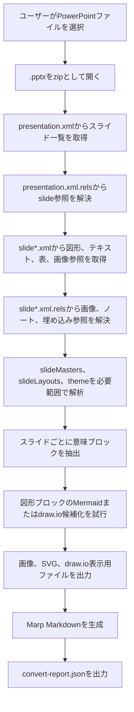

# F04 PowerPoint→Marp変換機能 機能設計書

## 1. 概要

本機能は、PowerPoint `.pptx` ファイルを解析し、AIが内容を理解しやすく、人間も編集しやすいMarp Markdownへ変換する。

PowerPointのスライド見た目を完全再現することよりも、スライドの順序、見出し、本文、表、画像、図解の意味をMarkdownとして扱えることを優先する。
見た目の再現が必要な要素は画像として保持し、編集しやすい要素はMarkdown、HTML、Mermaid、draw.io候補として出力する。

```text
PowerPoint .pptx
  → 内部変換データ
  → スライド別意味ブロック抽出
  → Marp Markdown
```

## 2. 変換方針

| 項目 | 方針 |
|---|---|
| 優先順位 | AIが内容を理解できること、人間がMarkdownとして編集しやすいこと、Marpでプレビューできること、Git差分でレビューしやすいこと、元PowerPointに近い見た目の順に優先する |
| PowerPoint解析方式 | `.pptx` を zip / Open XML として直接解析する |
| 出力構成 | メインMarp Markdown + resources + diagrams |
| スライド | PowerPointの各スライドをMarpの1スライドへ変換する |
| スライド区切り | Marpの `---` を使用する |
| タイトル | スライド内のタイトル候補をMarkdown見出しへ変換する |
| 本文 | テキストボックス、プレースホルダー、箇条書きをMarkdown本文へ変換する |
| 表 | HTML tableを基本とする |
| 画像 | `resources/` 配下へ外部ファイルとして出力し、Marp Markdownから相対参照する |
| 図形 | 単純な図解はMermaidまたはdraw.io候補化を試みる。難しい場合は画像フォールバックとする |
| ノート | 発表者ノートをMarp presenter notesとして出力する |
| テーマ | 初期対応ではMarp標準テーマを使用し、必要に応じて `theme.css` を追加する |
| 完全再現 | PowerPointの完全なレイアウト、アニメーション、画面切替は目的としない |

## 3. 対象範囲

### 3.1 対象

- `.pptx` 形式のPowerPointファイル
- 複数スライド
- スライドタイトル
- 段落、改行
- 箇条書き、番号付きリスト
- テキストボックス
- 表
- 画像
- 単純な図形テキスト
- 単純なフロー図、関係図のMermaidまたはdraw.io候補化
- 発表者ノート

### 3.2 対象外

- `.ppt` 旧形式
- パスワード付きPowerPoint
- マクロ実行
- アニメーション、画面切替
- 音声、動画
- SmartArtの完全再現
- グループ図形の完全な編集可能オブジェクト化
- PowerPointテーマ、マスター、レイアウトの完全再現
- フォント埋め込みデータの再利用
- PowerPointと完全一致する位置、余白、重なり順の再現

対象外要素は、取得できる情報に応じてMarkdown本文、Mermaid候補、draw.io候補、画像フォールバック、警告の順に扱う。

## 4. 入出力

### 4.1 入力

| 入力 | 内容 |
|---|---|
| PowerPointファイル | `.pptx` |
| ファイル選択方法 | 画面上で対象PowerPointファイルを右クリックし、変換メニューから選択する |

### 4.2 出力

入力PowerPointファイルと同一フォルダに、入力ファイル名のフォルダを作成する。

```text
入力:
  /path/to/sample.pptx

出力:
  /path/to/sample/sample.md
  /path/to/sample/resources/slide001-image001.png
  /path/to/sample/resources/slide002-image001.svg
  /path/to/sample/diagrams/slide003-diagram001.drawio
  /path/to/sample/diagrams/slide003-diagram001.drawio.svg
  /path/to/sample/theme.css
  /path/to/sample/convert-report.json
```

| 出力 | 内容 |
|---|---|
| Marp Markdown | 変換後のスライド本文。拡張子は `.md` |
| resources | Markdownから参照する画像、SVGなどのリソース |
| diagrams | draw.io候補として生成した `.drawio` と、Marp表示用の `.drawio.svg` または `.drawio.png` |
| theme.css | 必要な場合のみ出力するMarpテーマCSS |
| convert-report.json | 警告、変換できなかった要素、フォールバック内容を記録する |

## 5. 推奨フォルダ構成

PowerPoint→Marpでは、Markdown単体では画像や図を保持できない。
そのため、入力ファイル名フォルダを作成し、本文、画像、図解、変換ログを分けて管理する。

```text
sample/
  sample.md
  theme.css
  resources/
    slide001-image001.png
    slide002-image001.svg
    slide004-background001.jpeg
  diagrams/
    slide003-diagram001.drawio
    slide003-diagram001.drawio.svg
  convert-report.json
```

### 5.1 ファイル命名

| 種別 | 命名 |
|---|---|
| Marp Markdown | `<入力ファイル名>.md` |
| 画像 | `slide<3桁>-image<3桁>.<拡張子>` |
| 背景画像 | `slide<3桁>-background<3桁>.<拡張子>` |
| draw.io候補 | `slide<3桁>-diagram<3桁>.drawio` |
| draw.io表示用SVG | `slide<3桁>-diagram<3桁>.drawio.svg` |
| 変換ログ | `convert-report.json` |

### 5.2 Marpからの参照例

```md
---
marp: true
theme: default
paginate: true
---

# 企画概要

- 背景
- 目的
- スコープ

---

# システム構成


---

# 参考画像


```

## 6. Marp内でdraw.ioを表示する方針

Marp Markdown内にdraw.io図を表示したい場合は、`.drawio` XMLを直接埋め込むのではなく、表示用画像として参照する。

| 方式 | Marp表示 | draw.io編集 | 方針 |
|---|---:|---:|---|
| `.drawio` を直接参照 | 不可 | 可 | 採用しない |
| `.drawio.svg` を画像参照 | 可 | 可 | 推奨 |
| `.drawio.png` を画像参照 | 可 | 可 | SVG表示に問題がある場合の代替 |
| `.svg` をHTMLとして直接埋め込み | 可 | 条件付き | Markdownが読みにくくなるため原則採用しない |
| draw.io HTML embed | 条件付き | 条件付き | 外部JavaScriptやネットワーク依存が出るため採用しない |

推奨は、以下の2ファイルを同時に出力することである。

```text
diagrams/slide003-diagram001.drawio      # 編集用
diagrams/slide003-diagram001.drawio.svg  # Marp表示用
```

Marp本文では表示用SVGを通常の画像として参照する。

```md

```

draw.ioはPNG、SVG、PDFへ図の編集データを埋め込めるため、`.drawio.svg` は「Marpで表示できる画像」でありながら「draw.ioで再編集できる図」として扱える。
ただし、SVG内の `foreignObject`、フォント、複雑なHTMLラベルは表示環境によって崩れる可能性がある。
表示崩れが起きる場合は `.drawio.png` をMarp表示用に使い、`.drawio` を編集用として残す。

## 7. 全体処理フロー



## 8. Open XML解析

### 8.1 主な解析対象

| Open XMLファイル | 用途 |
|---|---|
| `ppt/presentation.xml` | スライド一覧、スライドサイズ |
| `ppt/_rels/presentation.xml.rels` | presentationからslide、theme、masterへの参照 |
| `ppt/slides/slide*.xml` | スライド内の図形、テキスト、表、画像参照 |
| `ppt/slides/_rels/slide*.xml.rels` | slideから画像、ノート、埋め込みオブジェクトへの参照 |
| `ppt/notesSlides/notesSlide*.xml` | 発表者ノート |
| `ppt/slideLayouts/slideLayout*.xml` | プレースホルダー、レイアウト情報 |
| `ppt/slideMasters/slideMaster*.xml` | 共通スタイル、背景、プレースホルダー |
| `ppt/theme/theme*.xml` | 色、フォントなどのテーマ情報 |
| `ppt/media/*` | 画像、SVGなどのバイナリ |
| `ppt/charts/chart*.xml` | グラフ情報。初期対応では対象外または警告 |
| `ppt/embeddings/*` | 埋め込みファイル。初期対応では対象外または警告 |

### 8.2 スライド本文

`ppt/slides/slide*.xml` の `p:cSld/p:spTree` 配下を順に解析し、各スライドの出力内容を決定する。
PowerPoint上の重なり順はMarkdownに向かないため、基本は上→下、左→右の位置順で出力する。

| PowerPoint要素 | 内部変換データ | Marp Markdown |
|---|---|---|
| `p:sp` | text / shape | 見出し、本文、箇条書き、図形候補 |
| `p:pic` | image | Markdown画像 |
| `p:graphicFrame/a:tbl` | table | HTML table |
| `p:graphicFrame/c:chart` | chart | データ表、Mermaid候補、または警告 |
| `p:grpSp` | group | 画像フォールバックまたは警告 |
| `p:cxnSp` | connector | Mermaidまたはdraw.io候補 |

## 9. 内部変換データ設計

内部変換データは、PowerPointのOpen XMLから取得した情報をMarp Markdown生成に使いやすい形へ整理したメモリ上のデータ構造である。
ファイルとしては出力しない。

### 9.1 全体項目

| 項目 | 内容 |
|---|---|
| `presentation` | PowerPoint全体の情報 |
| `slides` | スライドごとの解析結果配列 |
| `resources` | 画像、SVGなどの出力対象リソース一覧 |
| `diagrams` | Mermaidまたはdraw.io候補化した図解一覧 |
| `warnings` | 変換時の警告一覧 |

### 9.2 presentation

| 項目 | 内容 |
|---|---|
| `source` | 入力PowerPointファイルパス |
| `format` | 解析方式。`.pptx` をzip / Open XMLとして扱うため `pptx-zip` を設定する |
| `slide_count` | 解析対象スライド数 |
| `slide_width` | スライド幅。EMUまたはpx換算値 |
| `slide_height` | スライド高さ。EMUまたはpx換算値 |
| `theme` | 使用テーマ情報。初期対応では最小限 |

### 9.3 slides[]

| 項目 | 内容 |
|---|---|
| `index` | スライド番号 |
| `source` | zip内のslide XMLパス |
| `title` | タイトル候補 |
| `layout` | 参照するslideLayout |
| `blocks` | Markdown出力対象の意味ブロック配列 |
| `notes` | 発表者ノート |
| `background` | 背景情報。必要に応じて画像として出力する |
| `warnings` | スライド固有の警告 |

### 9.4 blocks[]

| 項目 | 内容 |
|---|---|
| `type` | `title`、`paragraph`、`list`、`table`、`image`、`diagram`、`note` など |
| `shape_id` | PowerPoint上の図形ID |
| `name` | PowerPoint上の図形名 |
| `text` | 抽出したテキスト |
| `runs` | 文字列と文字装飾の配列 |
| `position` | スライド上の位置。`x`、`y`、`width`、`height` |
| `level` | 箇条書き階層 |
| `rows` | 表の場合の行データ |
| `resource` | 画像の場合の出力ファイル情報 |
| `diagram` | Mermaidまたはdraw.io候補情報 |

### 9.5 resources[]

| 項目 | 内容 |
|---|---|
| `id` | 内部リソースID |
| `slide_index` | 参照元スライド番号 |
| `relationship_id` | slide rels上の参照ID |
| `source` | zip内の元ファイルパス |
| `output_path` | 出力先相対パス |
| `content_type` | MIME type |
| `kind` | `image`、`background`、`svg` など |

### 9.6 diagrams[]

| 項目 | 内容 |
|---|---|
| `id` | 内部図解ID |
| `slide_index` | 参照元スライド番号 |
| `type` | `mermaid` または `drawio` |
| `source_shapes` | 変換元図形ID一覧 |
| `editable_path` | 編集用ファイル。draw.ioの場合は `.drawio` |
| `preview_path` | Marp表示用ファイル。draw.ioの場合は `.drawio.svg` または `.drawio.png` |
| `code` | Mermaidの場合のコード |
| `warnings` | 図解変換時の警告 |

## 10. Markdown生成

### 10.1 Marpヘッダー

出力Markdownの先頭にはMarp用front matterを出力する。

```md
---
marp: true
theme: default
paginate: true
---
```

必要に応じて `theme: ./theme.css` 相当の設定を検討する。
ただし、初期対応ではMarp標準テーマを基本とする。

### 10.2 スライド生成

各PowerPointスライドは、Marpの1スライドとして出力する。

```md
---

# スライドタイトル

- 本文1
- 本文2
```

スライド内のタイトル候補が取得できない場合は、`# Slide 3` のような補助見出しを出力する。

### 10.3 箇条書き

PowerPointの段落階層をMarkdownのネストリストへ変換する。
階層は2スペースインデントを基本とする。

```md
- 親項目
  - 子項目
```

### 10.4 表

PowerPoint表は、セル結合や装飾を保持しやすいHTML tableとして出力する。
styleは意味を持つ範囲に限定する。

```html
<table>
  <tr>
    <th>項目</th>
    <th>内容</th>
  </tr>
  <tr>
    <td>目的</td>
    <td>変換方式の整理</td>
  </tr>
</table>
```

### 10.5 画像

画像は `resources/` 配下へ出力し、Markdownから相対参照する。

```md

```

スライド背景として使われている画像は、Marpの背景画像構文を使う。

```md

```

### 10.6 発表者ノート

発表者ノートはMarp presenter notesとして出力する。

```md
<!--
ここに発表者ノートを出力する。
-->
```

## 11. 図形・図解変換

PowerPoint図形は、Markdown上で完全再現しづらい。
そのため、以下の順に扱う。

1. Mermaid化できる単純図はMermaidコードとして出力する。
2. draw.io化できる図は `.drawio` と `.drawio.svg` を生成し、MarpではSVGを参照する。
3. 元ファイル内に画像として取得できる場合は画像として出力する。
4. どれにも変換できない場合は警告として扱う。

### 11.1 Mermaid化候補

| 図 | Mermaid種別 |
|---|---|
| 単純なフロー図 | `flowchart` |
| 時系列のやり取り | `sequenceDiagram` |
| 単純な円グラフ | `pie` |

### 11.2 draw.io化候補

PowerPoint上の図形、テキスト、線、矢印、座標をdraw.io XMLへ変換できる場合は、編集用draw.ioとして出力する。
Marpでは `.drawio.svg` を画像として表示する。

```md

```

## 12. Marp変換・確認コマンド

Marp CLIでHTML、PDF、PPTXへ変換する想定コマンドは以下とする。

```bash
npx @marp-team/marp-cli@latest sample.md -o sample.html --allow-local-files
npx @marp-team/marp-cli@latest sample.md -o sample.pdf --allow-local-files
npx @marp-team/marp-cli@latest sample.md -o sample.pptx --allow-local-files
```

ローカル画像、SVG、draw.io表示用ファイルを参照するため、PDF/PPTX変換では `--allow-local-files` を付与する。
入力Markdownが信頼できる場合のみ使用する。

## 13. エラー・警告

| 事象 | 方針 |
|---|---|
| `.pptx` として開けない | エラー終了 |
| パスワード付きPowerPoint | エラー終了 |
| slide参照が壊れている | 該当スライドをスキップし警告 |
| 画像参照が壊れている | 画像を出力せず警告 |
| 未対応図形 | テキスト抽出、画像フォールバック、警告の順に扱う |
| SmartArt | 初期対応では警告または画像フォールバック |
| 動画、音声 | 出力せず警告 |
| フォントが再現できない | Markdown本文を優先し警告 |

## 14. 制約

- PowerPointと完全一致するスライドレイアウトは保証しない。
- Marp Markdownは、PowerPointの自由配置、重なり順、アニメーション再現に向かない。
- ローカルリソースを使ってMarp CLIでPDF/PPTXへ変換する場合、`--allow-local-files` が必要になる。
- draw.ioはMarpへ直接埋め込まず、表示用SVGまたはPNGとして参照する。
- `.drawio.svg` は編集データを埋め込めるが、SVG表示環境によって一部ラベルやフォントが崩れる可能性がある。
- 大量の画像やSVGを含むPowerPointでは、出力フォルダサイズが大きくなる。

## 15. 参考情報

- MarpはMarkdownをHTML、PDF、PowerPointへ変換できる。
- Marp CLIはローカルファイル参照をセキュリティ上デフォルトで制限しており、必要な場合は `--allow-local-files` を使用する。
- draw.ioはPNG、SVG、PDFに図の編集データを埋め込める。
- draw.ioのSVG埋め込みはWebページ上で表示できるが、`foreignObject` など表示環境依存の制約がある。
