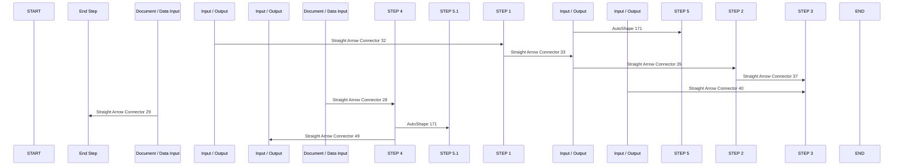

# BLANK - Swimlane Flowchart

## Table 1

<table>
  <tr>
    <td style="vertical-align:middle; font-weight:700"><strong>SWIMLANE FLOWCHART TEMPLATE for Excel</strong></td>
  </tr>
  <tr>
    <td style="text-align:left; vertical-align:middle">PROCESS</td>
  </tr>
</table>

## Table 2

<table>
  <tr>
    <td style="text-align:left; vertical-align:middle">PHASES</td>
    <td style="text-align:right; vertical-align:middle; color:#678E8D">JAN</td>
    <td style="text-align:right; vertical-align:middle; color:#678E8D">FEB</td>
    <td style="text-align:right; vertical-align:middle; color:#678E8D">MAR</td>
    <td style="text-align:right; vertical-align:middle; color:#678E8D">APR</td>
    <td style="text-align:right; vertical-align:middle; color:#678E8D">MAY</td>
    <td style="text-align:right; vertical-align:middle; color:#678E8D">JUN</td>
    <td style="text-align:right; vertical-align:middle; color:#678E8D">JUL</td>
    <td style="text-align:right; vertical-align:middle; color:#678E8D">AUG</td>
    <td style="text-align:right; vertical-align:middle; color:#678E8D">SEP</td>
    <td style="text-align:right; vertical-align:middle; color:#678E8D">OCT</td>
    <td style="text-align:right; vertical-align:middle; color:#678E8D">NOV</td>
    <td style="text-align:right; vertical-align:middle; color:#678E8D">DEC</td>
  </tr>
  <tr>
    <td style="border:1px solid #C4DDDE; background:#E9F6F2; text-align:left; vertical-align:middle; white-space:pre-wrap">Phase 1</td>
    <td style="border:1px solid #C4DDDE; background:#F2FCFB; text-align:left; vertical-align:middle; white-space:pre-wrap"></td>
    <td style="border:1px solid #C4DDDE; background:#F2FCFB; text-align:left; vertical-align:middle; white-space:pre-wrap"></td>
    <td style="border:1px solid #C4DDDE; background:#F2FCFB; text-align:left; vertical-align:middle; white-space:pre-wrap"></td>
    <td style="border:1px solid #C4DDDE; background:#F2FCFB; text-align:left; vertical-align:middle; white-space:pre-wrap"></td>
    <td style="border:1px solid #C4DDDE; background:#F2FCFB; text-align:left; vertical-align:middle; white-space:pre-wrap"></td>
    <td style="border:1px solid #C4DDDE; background:#F2FCFB; text-align:left; vertical-align:middle; white-space:pre-wrap"></td>
    <td style="border:1px solid #C4DDDE; background:#F2FCFB; text-align:left; vertical-align:middle; white-space:pre-wrap"></td>
    <td style="border:1px solid #C4DDDE; background:#F2FCFB; text-align:left; vertical-align:middle; white-space:pre-wrap"></td>
    <td style="border:1px solid #C4DDDE; background:#F2FCFB; text-align:left; vertical-align:middle; white-space:pre-wrap"></td>
    <td style="border:1px solid #C4DDDE; background:#F2FCFB; text-align:left; vertical-align:middle; white-space:pre-wrap"></td>
    <td style="border:1px solid #C4DDDE; background:#F2FCFB; text-align:left; vertical-align:middle; white-space:pre-wrap"></td>
    <td style="border:1px solid #C4DDDE; background:#F2FCFB; text-align:left; vertical-align:middle; white-space:pre-wrap"></td>
  </tr>
  <tr>
    <td style="border:1px solid #C4DDDE; background:#E9F6F2; text-align:left; vertical-align:middle; white-space:pre-wrap">Phase 2</td>
    <td style="border:1px solid #C4DDDE; background:#F2FCFB; text-align:left; vertical-align:middle; white-space:pre-wrap"></td>
    <td style="border:1px solid #C4DDDE; background:#F2FCFB; text-align:left; vertical-align:middle; white-space:pre-wrap"></td>
    <td style="border:1px solid #C4DDDE; background:#F2FCFB; text-align:left; vertical-align:middle; white-space:pre-wrap"></td>
    <td style="border:1px solid #C4DDDE; background:#F2FCFB; text-align:left; vertical-align:middle; white-space:pre-wrap"></td>
    <td style="border:1px solid #C4DDDE; background:#F2FCFB; text-align:left; vertical-align:middle; white-space:pre-wrap"></td>
    <td style="border:1px solid #C4DDDE; background:#F2FCFB; text-align:left; vertical-align:middle; white-space:pre-wrap"></td>
    <td style="border:1px solid #C4DDDE; background:#F2FCFB; text-align:left; vertical-align:middle; white-space:pre-wrap"></td>
    <td style="border:1px solid #C4DDDE; background:#F2FCFB; text-align:left; vertical-align:middle; white-space:pre-wrap"></td>
    <td style="border:1px solid #C4DDDE; background:#F2FCFB; text-align:left; vertical-align:middle; white-space:pre-wrap"></td>
    <td style="border:1px solid #C4DDDE; background:#F2FCFB; text-align:left; vertical-align:middle; white-space:pre-wrap"></td>
    <td style="border:1px solid #C4DDDE; background:#F2FCFB; text-align:left; vertical-align:middle; white-space:pre-wrap"></td>
    <td style="border:1px solid #C4DDDE; background:#F2FCFB; text-align:left; vertical-align:middle; white-space:pre-wrap"></td>
  </tr>
  <tr>
    <td style="border:1px solid #C4DDDE; background:#E9F6F2; text-align:left; vertical-align:middle; white-space:pre-wrap">Phase 3</td>
    <td style="border:1px solid #C4DDDE; background:#F2FCFB; text-align:left; vertical-align:middle; white-space:pre-wrap"></td>
    <td style="border:1px solid #C4DDDE; background:#F2FCFB; text-align:left; vertical-align:middle; white-space:pre-wrap"></td>
    <td style="border:1px solid #C4DDDE; background:#F2FCFB; text-align:left; vertical-align:middle; white-space:pre-wrap"></td>
    <td style="border:1px solid #C4DDDE; background:#F2FCFB; text-align:left; vertical-align:middle; white-space:pre-wrap"></td>
    <td style="border:1px solid #C4DDDE; background:#F2FCFB; text-align:left; vertical-align:middle; white-space:pre-wrap"></td>
    <td style="border:1px solid #C4DDDE; background:#F2FCFB; text-align:left; vertical-align:middle; white-space:pre-wrap"></td>
    <td style="border:1px solid #C4DDDE; background:#F2FCFB; text-align:left; vertical-align:middle; white-space:pre-wrap"></td>
    <td style="border:1px solid #C4DDDE; background:#F2FCFB; text-align:left; vertical-align:middle; white-space:pre-wrap"></td>
    <td style="border:1px solid #C4DDDE; background:#F2FCFB; text-align:left; vertical-align:middle; white-space:pre-wrap"></td>
    <td style="border:1px solid #C4DDDE; background:#F2FCFB; text-align:left; vertical-align:middle; white-space:pre-wrap"></td>
    <td style="border:1px solid #C4DDDE; background:#F2FCFB; text-align:left; vertical-align:middle; white-space:pre-wrap"></td>
    <td style="border:1px solid #C4DDDE; background:#F2FCFB; text-align:left; vertical-align:middle; white-space:pre-wrap"></td>
  </tr>
  <tr>
    <td style="border:1px solid #C4DDDE; background:#E9F6F2; text-align:left; vertical-align:middle; white-space:pre-wrap">Phase 4</td>
    <td style="border:1px solid #C4DDDE; background:#F2FCFB; text-align:left; vertical-align:middle; white-space:pre-wrap"></td>
    <td style="border:1px solid #C4DDDE; background:#F2FCFB; text-align:left; vertical-align:middle; white-space:pre-wrap"></td>
    <td style="border:1px solid #C4DDDE; background:#F2FCFB; text-align:left; vertical-align:middle; white-space:pre-wrap"></td>
    <td style="border:1px solid #C4DDDE; background:#F2FCFB; text-align:left; vertical-align:middle; white-space:pre-wrap"></td>
    <td style="border:1px solid #C4DDDE; background:#F2FCFB; text-align:left; vertical-align:middle; white-space:pre-wrap"></td>
    <td style="border:1px solid #C4DDDE; background:#F2FCFB; text-align:left; vertical-align:middle; white-space:pre-wrap"></td>
    <td style="border:1px solid #C4DDDE; background:#F2FCFB; text-align:left; vertical-align:middle; white-space:pre-wrap"></td>
    <td style="border:1px solid #C4DDDE; background:#F2FCFB; text-align:left; vertical-align:middle; white-space:pre-wrap"></td>
    <td style="border:1px solid #C4DDDE; background:#F2FCFB; text-align:left; vertical-align:middle; white-space:pre-wrap"></td>
    <td style="border:1px solid #C4DDDE; background:#F2FCFB; text-align:left; vertical-align:middle; white-space:pre-wrap"></td>
    <td style="border:1px solid #C4DDDE; background:#F2FCFB; text-align:left; vertical-align:middle; white-space:pre-wrap"></td>
    <td style="border:1px solid #C4DDDE; background:#F2FCFB; text-align:left; vertical-align:middle; white-space:pre-wrap"></td>
  </tr>
  <tr>
    <td style="border:1px solid #C4DDDE; background:#E9F6F2; text-align:left; vertical-align:middle; white-space:pre-wrap">Phase 5</td>
    <td style="border:1px solid #C4DDDE; background:#F2FCFB; text-align:left; vertical-align:middle; white-space:pre-wrap"></td>
    <td style="border:1px solid #C4DDDE; background:#F2FCFB; text-align:left; vertical-align:middle; white-space:pre-wrap"></td>
    <td style="border:1px solid #C4DDDE; background:#F2FCFB; text-align:left; vertical-align:middle; white-space:pre-wrap"></td>
    <td style="border:1px solid #C4DDDE; background:#F2FCFB; text-align:left; vertical-align:middle; white-space:pre-wrap"></td>
    <td style="border:1px solid #C4DDDE; background:#F2FCFB; text-align:left; vertical-align:middle; white-space:pre-wrap"></td>
    <td style="border:1px solid #C4DDDE; background:#F2FCFB; text-align:left; vertical-align:middle; white-space:pre-wrap"></td>
    <td style="border:1px solid #C4DDDE; background:#F2FCFB; text-align:left; vertical-align:middle; white-space:pre-wrap"></td>
    <td style="border:1px solid #C4DDDE; background:#F2FCFB; text-align:left; vertical-align:middle; white-space:pre-wrap"></td>
    <td style="border:1px solid #C4DDDE; background:#F2FCFB; text-align:left; vertical-align:middle; white-space:pre-wrap"></td>
    <td style="border:1px solid #C4DDDE; background:#F2FCFB; text-align:left; vertical-align:middle; white-space:pre-wrap"></td>
    <td style="border:1px solid #C4DDDE; background:#F2FCFB; text-align:left; vertical-align:middle; white-space:pre-wrap"></td>
    <td style="border:1px solid #C4DDDE; background:#F2FCFB; text-align:left; vertical-align:middle; white-space:pre-wrap"></td>
  </tr>
</table>

## Table 3

<table>
  <tr>
    <td style="text-align:left; vertical-align:middle">Flowchart Elements</td>
  </tr>
</table>

## Diagram 1

