# School1

## Table 1

<table>
  <tr>
    <td colspan="19" style="text-align:center; vertical-align:middle">School Organizational Chart</td>
  </tr>
</table>

## Image 1

## Table 2

<table>
  <tr>
    <td style="border:1px solid #D9D9D9; text-align:left; vertical-align:middle"><u>Organizational Chart Templates</u></td>
  </tr>
  <tr>
    <td style="border:1px solid #D9D9D9; text-align:left; vertical-align:middle">© 2009-2018 by Vertex42.com</td>
  </tr>
  <tr>
    <td style="border:1px solid #D9D9D9; vertical-align:middle"></td>
  </tr>
  <tr>
    <td style="border:1px solid #D9D9D9; text-align:left; vertical-align:middle"><u>► More Business Templates</u></td>
  </tr>
  <tr>
    <td style="border:1px solid #D9D9D9; text-align:left; vertical-align:middle"><u>► More Project Management Templates</u></td>
  </tr>
</table>

## Diagram 1

```mermaid
sequenceDiagram
  participant P1 as Assistant PrincipalCurriculum & Instruction[Name]
  participant P2 as Instructional Coaches
  participant P3 as Library
  participant P4 as Summer School
  participant P5 as Aides
  participant P6 as Schedules
  participant P7 as Other
  participant P8 as Other
  participant P9 as Assistant PrincipalPupil Personnel[Name]
  participant P10 as Guidance Counselors
  participant P11 as Nurse
  participant P12 as Social Worker
  participant P13 as Report Cards / Grades
  participant P14 as Testing
  participant P15 as Other
  participant P16 as Other
  participant P17 as Principal[Name]
  participant P18 as Assistant PrincipalBuilding Control[Name]
  participant P19 as Discipline
  participant P20 as Deans
  participant P21 as Saturday Detention
  participant P22 as Building Supervision
  participant P23 as Attendance Officer
  participant P24 as Student Transportation
  participant P25 as Other
  participant P26 as Athletics Director[Name]
  participant P27 as Coaches
  participant P28 as Assistant Coaches
  participant P29 as Activities Director
  participant P30 as Sponsors
  participant P31 as Scheduling
  participant P32 as Events
  participant P33 as Other
  P17->>P26: Elbow Connector 32
  P17->>P1: Elbow Connector 22
  P17->>P18: Elbow Connector 24
  P17->>P9: Elbow Connector 23
  P1->>P2: Elbow Connector 5
  P1->>P3: Elbow Connector 7
  P1->>P4: Elbow Connector 9
  P9->>P10: Elbow Connector 11
  P9->>P11: Elbow Connector 13
  P9->>P12: Elbow Connector 15
  P18->>P19: Elbow Connector 19
  P18->>P20: Elbow Connector 20
  P18->>P21: Elbow Connector 21
  P9->>P13: Elbow Connector 27
  P1->>P5: Elbow Connector 28
  P18->>P22: Elbow Connector 29
  P26->>P27: Elbow Connector 31
  P9->>P14: Elbow Connector 35
  P9->>P15: Elbow Connector 36
  P1->>P6: Elbow Connector 38
  P1->>P7: Elbow Connector 40
  P1->>P8: Elbow Connector 42
  P9->>P16: Elbow Connector 44
  P18->>P23: Elbow Connector 51
  P18->>P24: Elbow Connector 52
  P18->>P25: Elbow Connector 53
  P26->>P28: Elbow Connector 61
  P26->>P29: Elbow Connector 62
  P26->>P30: Elbow Connector 63
  P26->>P31: Elbow Connector 64
  P26->>P32: Elbow Connector 65
  P26->>P33: Elbow Connector 66
```

