<p style="text-align:center"><strong><span style="color:#1F4E79; font-size:20pt">AnalysisPlace </span></strong></p>

<p style="text-align:center"><strong><span style="color:#1F4E79; font-size:20pt">Excel-to-Word Document Automation Add-In</span></strong></p>

<p style="text-align:center">Update/create Word and PowerPoint content (text, tables, and charts) based on Excel data and calculations.</p>

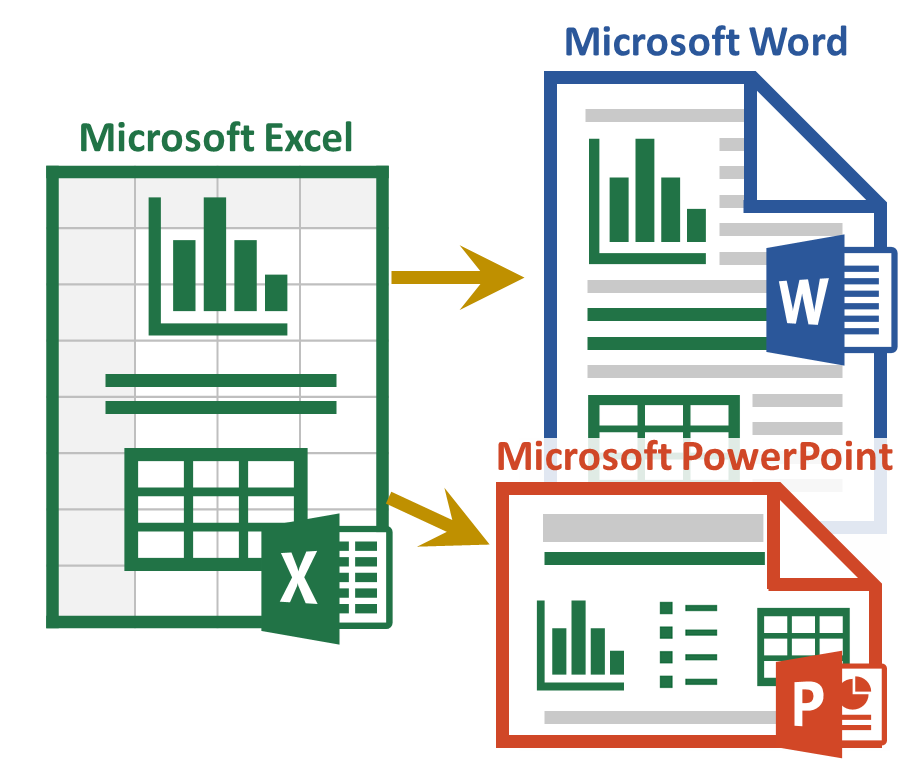

# <strong><span style="color:#4472C4; font-size:36pt">Sample Content and How-To Guide</span></strong>

This document demonstrates key capabilities of the add-in. Use it with

<span style="color:#5A5A5A">Also see the</span><strong><span style="color:#5A5A5A"> </span></strong>

<strong><span style="color:#5A5A5A">To use this document:  </span></strong>

<strong><span style="color:#5A5A5A">In </span></strong><strong><span style="color:#538135">Excel</span></strong><strong><span style="color:#5A5A5A">:</span></strong>

- <span style="color:#5A5A5A">Add the add-in (Excel Ribbon Menu: Insert &gt; Get Add-ins), then activate it (right side of Home ribbon)</span>

- <span style="color:#5A5A5A">“Insert Sample Content” on the Start tab of the add-in</span>

- <span style="color:#5A5A5A">Make changes to any of the tan input cells in the workbook. Start with the QuickStart worksheet </span>

- <span style="color:#5A5A5A">“Submit Content” in the Excel add-in</span>

<strong><span style="color:#5A5A5A">Here In </span></strong><strong><span style="color:#4472C4">Word</span></strong><strong><span style="color:#5A5A5A">:</span></strong>

- <span style="color:#5A5A5A">If the add-in is not visible, add/activate it</span>

- <span style="color:#5A5A5A">“Update Document”, in the add-in in this document. You should be able to see the changes starting on the next page based on your Excel modifications</span>

<span style="color:#7F7F7F; font-size:11pt">If you are not already familiar with the basic features of the add-in, first see </span>

<em><span style="color:#5A5A5A">This document has “Auto-Open” enabled, meaning the add-in should automatically open with the document. Normally Auto-Open can only be enabled with Excel workbooks.</span></em>

## <strong><span style="color:#2E74B5; font-size:22pt">QuickStart Sample Content</span></strong>

<em><span style="color:#538135; font-size:10pt">See Excel Worksheet</span></em><em><strong><span style="color:#538135; font-size:10pt">: QuickStart</span></strong></em>

<span style="color:#7F7F7F; font-size:10pt">The “dynamic” content in this section will be updated based on the data submitted from Excel when you click “Update Document” in the Update tab.</span>

### <strong><span style="color:#404040; font-size:16pt">Example Text</span></strong>

<span style="color:#000000; font-size:10pt">The text below is updated based on the Excel “r_TextSummary” range under the “Summary” heading:</span>

<span style="color:#000000; font-size:10pt">Text links can also appear mixed in with other text:  is the customer name (it’s source is “r_CustomerName”).</span>

### <strong><span style="color:#404040; font-size:16pt">Example Tables</span></strong>

#### <strong><span style="color:#1F4D78; font-size:12pt">Destination Table</span></strong>

<span style="color:#7F7F7F; font-size:10pt">The table below is updated based on the “r_ROISumTable” range in Excel. It is a Destination-formatted table, so only the text/values will be updated – the format is set here in Word and won’t be modified by the update.</span>

#### <strong><span style="color:#1F4D78; font-size:12pt">Flex Table</span></strong>

<span style="color:#7F7F7F; font-size:10pt">The Flex Table below is based on the “r_ROISumTableFlex” range. It is Excel-formatted, so any changes in Excel (format or values) will be shown below after the update.</span>

### <strong><span style="color:#404040; font-size:16pt">Example Charts</span></strong>

<span style="color:#7F7F7F; font-size:10pt">This chart is updated based on the Excel table named “r_LineChart”:</span>

<span style="color:#7F7F7F; font-size:10pt">This chart (a png image) is updated based on the Excel chart named “r_CostsVsBenefitsChart”:</span>

### <strong><span style="color:#404040; font-size:16pt">Example Shape</span></strong>

<span style="color:#7F7F7F; font-size:10pt">This image is based on the shape named “r_ScrollShape”</span>

## <strong><span style="color:#2E74B5; font-size:22pt">Table of Contents</span></strong>

## <strong><span style="color:#2E74B5; font-size:22pt">Text, Bullet Lists, and Paragraphs</span></strong>

<em><span style="color:#538135; font-size:10pt">See Excel Worksheet</span></em><em><strong><span style="color:#538135; font-size:10pt">: Text</span></strong></em>

<span style="color:#7F7F7F; font-size:10pt">Excel-sourced text can be incorporated into documents in a variety of ways. </span>

<span style="color:#7F7F7F; font-size:10pt">Single-cell named ranges update text items (e.g. titles, paragraphs, parts of text, lists) in Word/PowerPoint.</span>

<span style="color:#7F7F7F; font-size:10pt">All linked content in Word is included in Content Controls. You can hide the Content Controls (e.g. prior to sending to customers) by selecting “Hide” at the bottom of the “Link” tab in the add-in.</span>

### <strong><span style="color:#404040; font-size:16pt">Add Text to Various Document Content Types</span></strong>

<span style="color:#7F7F7F; font-size:10pt">Linked text can include or can be within: paragraphs, titles, text boxes, most shapes, WordArt, headers/footers, or a table cell. You can style the text as desired (colors, bold, font, etc.) and the style will remain after the update. </span>

<span style="color:#7F7F7F; font-size:10pt"> This example shows the linked text within a shape:</span>

> 図形テキスト: 38100Customer XYZ

### <strong><span style="color:#404040; font-size:16pt">Combining Text and Data </span></strong>

<span style="color:#7F7F7F; font-size:10pt">Data can easily be combined with text using the text() formula in Excel:</span>

### <strong><span style="color:#404040; font-size:16pt">Lists and Paragraphs</span></strong>

<span style="color:#7F7F7F; font-size:10pt">The add-in can create lists that change based on formulas in Excel. List are based formulas in a single cell.</span>

- Lists from Excel (a single link/control) can be styled as bullets or numbered lists.

- Alt-enter is typically used for manually created lists.

- Char(10) is used if you want to list to change dynamically (part of a formula).

- In cloud-created reports (PowerPoint or template-based Word reports), you can add multiple levels (indents) to your bullet lists by adding a greater-than symbol "&gt;" to the start of the line in Excel. Add 2 "&gt;&gt;" for level 2 or  "&gt;&gt;&gt;" for level 3 indents. These can be added dynamically to formulas.

<span style="color:#7F7F7F; font-size:10pt">This example shows a dynamically created (based on an Excel formula) </span><strong><span style="color:#7F7F7F; font-size:10pt">bullet list</span></strong><span style="color:#7F7F7F; font-size:10pt">:</span>

<span style="color:#7F7F7F; font-size:10pt">In this example, the items are an automatically </span><strong><span style="color:#7F7F7F; font-size:10pt">numbered list</span></strong><span style="color:#7F7F7F; font-size:10pt">:</span>

<span style="color:#7F7F7F; font-size:10pt">This example shows dynamically created (Excel-sourced) </span><strong><span style="color:#7F7F7F; font-size:10pt">paragraphs</span></strong><span style="color:#7F7F7F; font-size:10pt">:</span>

## <strong><span style="color:#2E74B5; font-size:22pt">Tables</span></strong>

<em><span style="color:#5B9BD5; font-size:10pt">See Excel Worksheet</span></em><em><strong><span style="color:#5B9BD5; font-size:10pt">: Tables</span></strong></em>

### <strong><span style="color:#404040; font-size:16pt">Overview</span></strong>

<span style="color:#7F7F7F; font-size:10pt">The add-in was designed to update Word/PowerPoint tables for a variety of scenarios, including updating of large/complex tables, such as financial reports. </span>

<span style="color:#7F7F7F; font-size:10pt">The add-in allows you to update Word and PowerPoint tables in 3 ways: 1. Destination-formatted tables, 2. Excel-formatted (Flex) tables, and 3. Via an image of the source range/table.</span>

<span style="color:#7F7F7F; font-size:10pt">See the “Tables” tab in the workbook for a detailed comparison</span>

<em><span style="color:#538135; font-size:10pt">See Excel Worksheet</span></em><em><strong><span style="color:#538135; font-size:10pt">: Tables</span></strong></em>

<span style="color:#7F7F7F; font-size:10pt">This table will update based on changes made to the range name: r_TableComparison</span>

## <strong><span style="color:#2E74B5; font-size:22pt">Destination-Formatted Tables</span></strong>

<span style="color:#7F7F7F; font-size:10pt">Formatting is applied in the destination (Word or PowerPoint) -- the update does not modify the table format, only the text/values</span>

<em><span style="color:#538135; font-size:10pt">See Excel Worksheet</span></em><em><strong><span style="color:#538135; font-size:10pt">: Dest</span></strong></em>

### <strong><span style="color:#404040; font-size:16pt">Named Ranges Vs. Data Tables</span></strong>

<span style="color:#7F7F7F; font-size:10pt">Source Excel data can be based on </span><strong><span style="color:#7F7F7F; font-size:10pt">named ranges</span></strong><span style="color:#7F7F7F; font-size:10pt"> or tables (</span><strong><span style="color:#7F7F7F; font-size:10pt">data tables</span></strong><span style="color:#7F7F7F; font-size:10pt">). They both can update Word/PowerPoint tables the same way. The first and third tables below are based on named ranges; the second is based on an Excel table.</span>

### <strong><span style="color:#404040; font-size:16pt">Create and Format Tables</span></strong>

<span style="color:#7F7F7F; font-size:10pt">In Word, you can link tables in 3 ways (first Add-in &gt; Link &gt; “Get Excel Source Data” &gt; Select your table source from the drop-downs):</span>

1. **Insert a new table**:  (Ribbon &gt; Insert &gt; Tables &gt; Table); format the table (Ribbon &gt; Table Tools &gt; Design); select the entire table by clicking the icon above/left of the table; then link the table (Add-in &gt; Link &gt; “Insert Content / Update Link”).

1. **Link an existing table**: select the entire table, then “Insert Content / Update Link“ button. The table should have the same number of rows/columns as the source Excel table/range.

1. **Insert and Link**: put the cursor where you’d like the table, then simply click the “Insert Content / Update Link“ button.

<span style="color:#7F7F7F; font-size:10pt">You can style tables (Table Styles, borders, font, colors, etc.) and the style will remain after the update (only the text will update).</span>

### <strong><span style="color:#404040; font-size:16pt">Automatic Table Resizing (Insert/Delete Rows/Columns)</span></strong>

<span style="color:#7F7F7F; font-size:10pt">The add-in will try to resize Word/PowerPoint tables to match the size of the source Excel table/range. For example, if the Excel table has 7 rows and the Word table has 4, the add-in will insert 3 rows. The next-to-the-last row/column will be used for the format template for the inserted rows/columns.</span>

<span style="color:#7F7F7F; font-size:10pt">There are some limitations, for example, the Word add-in cannot insert/delete columns if there are merged cells in the table.</span>

### <strong><span style="color:#404040; font-size:16pt">Table Merged Cells</span></strong>

<span style="color:#7F7F7F; font-size:10pt">The add-in supports most Word/PowerPoint table merged cell scenarios. The table below contains 2 merged cell areas in the 1st row.</span>

<span style="color:#7F7F7F; font-size:10pt">If the add-in does not place content in the desired Word cell, try adding a space to the empty Excel cell to the left of the data that ends up misplaced.</span>

### <strong><span style="color:#404040; font-size:16pt">Hide Table Rows</span></strong>

<span style="color:#7F7F7F; font-size:10pt">To include visible rows/columns only: in Excel, set Item Property "Include hidden rows &amp; columns" to 'No' or add the suffix "_visible" (or "_vis") before the range or table name. Hidden, filtered, or grouped rows will not appear in your Word/PowerPoint table. Can be combined with _body. </span>

<span style="color:#7F7F7F; font-size:10pt">The table below demonstrates this – it only includes visible rows in the source Excel table. The table is resized to match the Excel table visible row and column counts.</span>

### <strong><span style="color:#404040; font-size:16pt">Simple Financial Statement Example</span></strong>

<span style="color:#7F7F7F; font-size:10pt">This example demonstrates that the destination content appearance can be very different from the source Excel format.</span>

## <strong><span style="color:#2E74B5; font-size:22pt">Flex Tables (Excel-Formatted)</span></strong>

<span style="color:#7F7F7F; font-size:10pt">Flex Tables (including format) are created in Excel and replace the Word table during the update.</span>

<em><span style="color:#538135; font-size:10pt">See Excel Worksheet</span></em><em><strong><span style="color:#538135; font-size:10pt">: Flex</span></strong></em>

<span style="color:#5A5A5A">Also see the</span><strong><span style="color:#5A5A5A"> </span></strong>

### <strong><span style="color:#404040; font-size:16pt">Income Statement Example</span></strong>

<span style="color:#7F7F7F; font-size:10pt">Flex tables can update many large tables in a document</span>

### <strong><span style="color:#404040; font-size:16pt">Table with Conditional Formatting</span></strong>

<span style="color:#7F7F7F; font-size:10pt">Supported Conditional Formatting formats: background color, font color, border color, bold, italics, and underline</span>

### <strong><span style="color:#404040; font-size:16pt">Titles in Columns Example</span></strong>

### <strong><span style="color:#404040; font-size:16pt">HTML in Cells</span></strong>

<span style="color:#7F7F7F; font-size:10pt">Most HTML/CSS can be included in Flex table cells.</span>

## <strong><span style="color:#2E74B5; font-size:22pt">Image of Ranges</span></strong>

<em><span style="color:#538135; font-size:10pt">See Excel Worksheet</span></em><em><strong><span style="color:#538135; font-size:10pt">: Image</span></strong></em>

<span style="color:#7F7F7F; font-size:10pt">This feature transfers the image (PNG) of the named range, just as it looks in Excel.</span>

<span style="color:#7F7F7F; font-size:10pt">Name the cell or range of cells (starting with the prefix and ending with "_img"). Include any content in the range (conditional formatting, sparklines, images, shapes, text boxes, smart art, dynamic items, etc.) The image (PNG) of all content in the range will be transferred to your Word/Ppt document just the way it appears in Excel. </span>

<span style="color:#7F7F7F; font-size:10pt">Large images significantly increase transfer size and will make the Word/PowerPoint file much larger.</span>

### <strong><span style="color:#404040; font-size:16pt">Image based on range containing a variety of formula-based elements</span></strong>

<span style="color:#7F7F7F; font-size:10pt">This example shows sparklines, conditional formatting, and a chart in a range. The source of the image below is a named range in Excel.</span>

<span style="color:#2E74B5; font-size:16pt">Border Issue Fix</span>

<span style="color:#7F7F7F; font-size:10pt">Original png image (missing border):</span>

<span style="color:#7F7F7F; font-size:10pt">Fix applied (paste as linked picture)</span>

## <strong><span style="color:#2E74B5; font-size:22pt">Charts</span></strong>

<em><span style="color:#538135; font-size:10pt">See Excel Worksheet</span></em><em><strong><span style="color:#538135; font-size:10pt">: Charts</span></strong></em>

<span style="color:#7F7F7F; font-size:10pt">The chart examples below have been linked to the table “r_CommonCharts”</span>

> 図形テキスト: 0
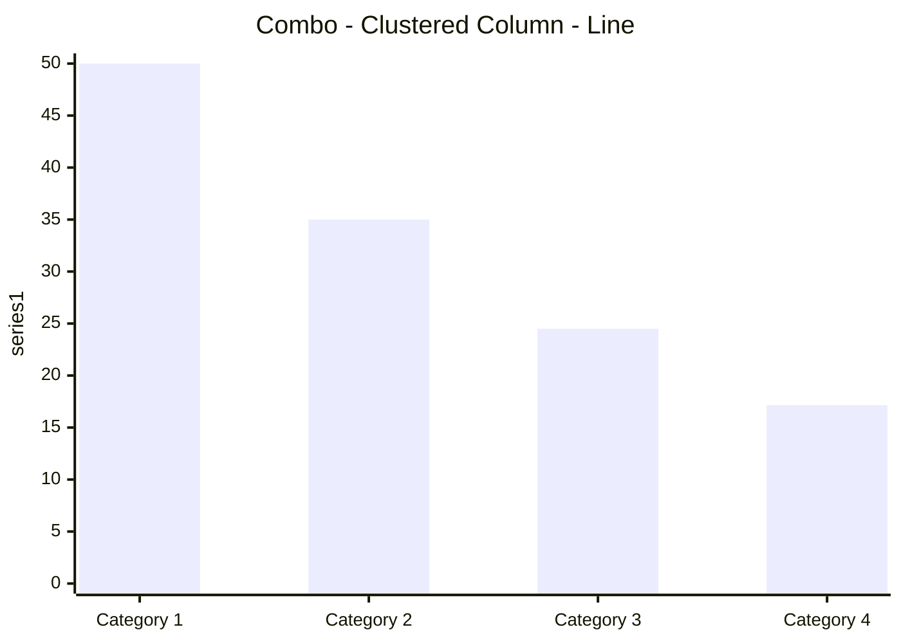

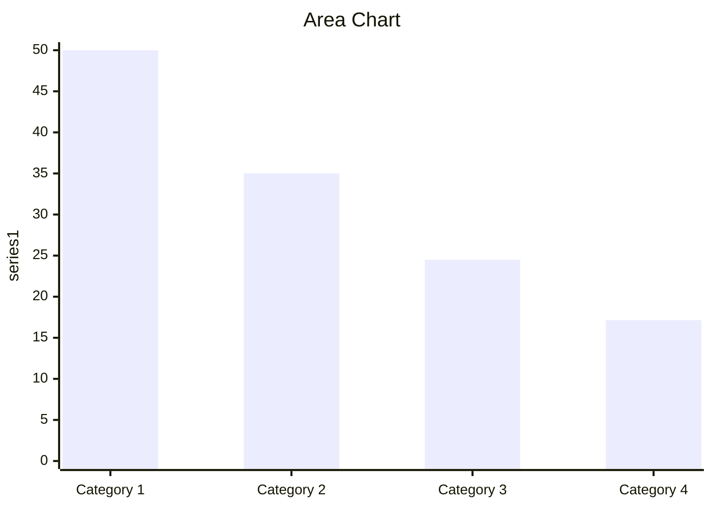
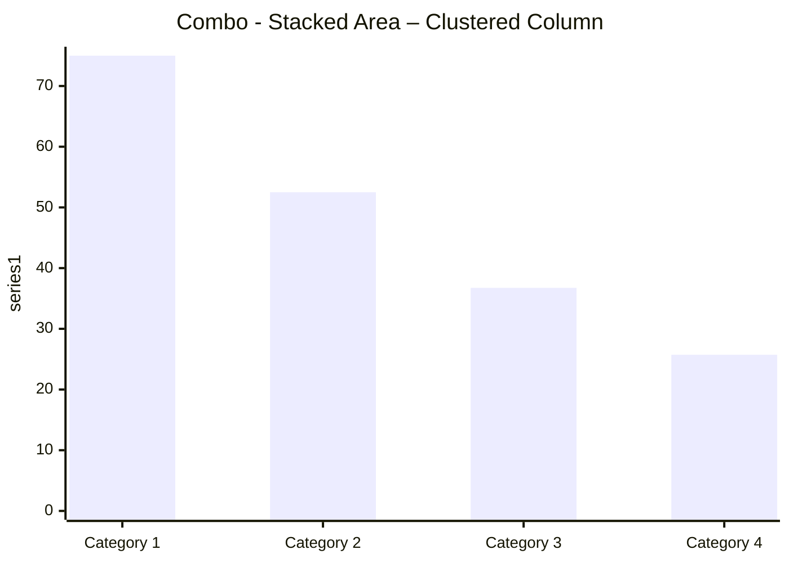

<span style="color:#7F7F7F; font-size:10pt">The chart example below with date based items has been linked to the table “r_DateCharts”</span>

<span style="color:#7F7F7F; font-size:10pt"> The Pie Chart examples below have been linked to the table “r_PieCharts”</span>

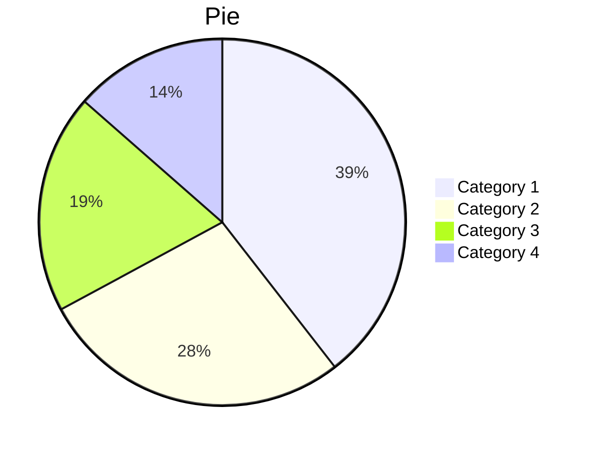
> 図形テキスト: 0

<span style="color:#7F7F7F; font-size:10pt">The Scatter Chart examples below have been linked to the tables “r_Scatter” and “r_Scatter2Series”</span>

| chart | series | category | value |
| --- | --- | --- | --- |
| chart | series | category | value |
| --- | --- | --- | --- |

<span style="color:#7F7F7F; font-size:10pt">The Stock Chart example below has been linked to the table “r_StockChart”</span>

<span style="color:#7F7F7F; font-size:10pt">The Sunburst Chart below has been linked to the table “r_Sunburst”</span>


> 図形テキスト: 0
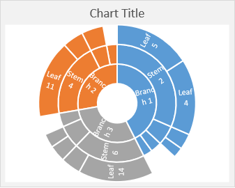

<span style="color:#7F7F7F; font-size:10pt">The TreeMap Chart below has been linked to the table “r_TreeMap”</span>

## <strong><span style="color:#2E74B5; font-size:22pt">Chart / Graph Images</span></strong>

<em><span style="color:#538135; font-size:10pt">See Excel Worksheet</span></em><em><strong><span style="color:#538135; font-size:10pt">: Chart Img</span></strong></em>

<span style="color:#7F7F7F; font-size:10pt">When charts are submitted, the chart image (PNG) will be transferred to your Word/PowerPoint document. So format them in Excel the way you want them to look in your document.</span>

<span style="color:#7F7F7F; font-size:10pt">You can use essentially any type of chart/graph.</span>

### <strong><span style="color:#404040; font-size:16pt">Image Size, Quality, and Resolution</span></strong>

### <strong><span style="color:#404040; font-size:16pt">Charts with Added Content</span></strong>

<span style="color:#7F7F7F; font-size:10pt">You can include other content to your charts, such as dynamic text, images, shapes, etc.</span>

<span style="color:#7F7F7F; font-size:10pt">This feature can enable very powerful/flexible content automation capabilities.</span>

<span style="color:#7F7F7F; font-size:10pt">The chart below contains formula-based text and an image which will update based on the growth rate:</span>

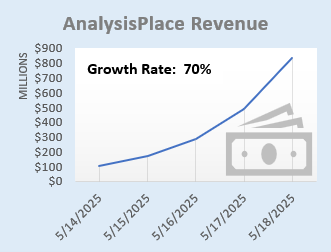


## <strong><span style="color:#2E74B5; font-size:22pt">PivotTables</span></strong>

<em><span style="color:#538135; font-size:10pt">See Excel Worksheet</span></em><em><strong><span style="color:#538135; font-size:10pt">: Pivot</span></strong></em>

<span style="color:#7F7F7F; font-size:10pt">Use Excel PivotTables for the source of tables (including images of tables)</span>

### <strong><span style="color:#404040; font-size:16pt">Flex Table (Excel Formatted)</span></strong>

### <strong><span style="color:#404040; font-size:16pt">Destination-formatted PivotTable</span></strong>

### <strong><span style="color:#404040; font-size:16pt">Image of PivotTable</span></strong>

## <strong><span style="color:#2E74B5; font-size:22pt">Shape and Images</span></strong>

<em><span style="color:#538135; font-size:10pt">See Excel Worksheet</span></em><em><strong><span style="color:#538135; font-size:10pt">: Shapes</span></strong></em>

<span style="color:#7F7F7F; font-size:10pt">Transfer any type of shape to your Word/PPT document: text boxes, lines, geometric shapes, SmartArt, WordArt, pictures/photos, icons, maps, and equations. Shapes can contain dynamic content (based on a formula or using automation such as VBA macros or other add-ins).</span>

<span style="color:#7F7F7F; font-size:10pt">Shapes with Data rShapesWithData</span>

<span style="color:#7F7F7F; font-size:10pt">rEquation</span>

<span style="color:#7F7F7F; font-size:10pt">rPictureWithText</span>


## <strong><span style="color:#2E74B5; font-size:22pt">Image updated based on user selection or cell formula</span></strong>

<span style="color:#7F7F7F; font-size:10pt">The example below displays a flag image based on a country that is selected based on a drop-down list in Excel. It shows an image which appears in a single cell in Excel. This technique is commonly used to display product images based on selected/configured solution or people photos.</span>

<span style="color:#7F7F7F; font-size:10pt">Country Selected: </span>

<strong><span style="color:#1F4E78; font-size:15pt">Image in a Cell (Paste Picture in Cell)</span></strong>

<span style="color:#000000; font-size:12pt">Allows you to use formulas/logic to submit/update different pictures based on a configured scenario</span>

<span style="color:#7F7F7F; font-size:10pt">r_SelectedPicture_img</span>

<strong><span style="color:#1F4E78; font-size:15pt">Image Function</span></strong>

<span style="color:#7F7F7F; font-size:10pt">The =image() function can also insert an image based on a URL. It is not shown here because it requires a security approval in Excel.</span>

<span style="color:#7F7F7F; font-size:10pt">Depending on your needs, there are also many ways to use VBA macros (and other add-ins) to modify the image displayed in the cell (which can be updated in Word/PowerPoint). Images could also be based on a URL from a remote web site.</span>

## <strong><span style="color:#2E74B5; font-size:22pt">URL-Based Images</span></strong>

<em><span style="color:#538135; font-size:10pt">See Excel Worksheet</span></em><em><strong><span style="color:#538135; font-size:10pt">: URL Img</span></strong></em>

<span style="color:#7F7F7F; font-size:10pt">Use image URLs to dynamically populate documents with product photos, logos, profile images, property photos, maps, and more.</span>

### <strong><span style="color:#404040; font-size:16pt">Image Appears in Excel</span></strong>

<span style="color:#7F7F7F; font-size:10pt">In these examples, the image appears in Excel, then the image is transferred to Word or PowerPoint:</span>

<span style="color:#7F7F7F; font-size:10pt">Basic Example (shape name: r_CylinderShape):</span>

<span style="color:#7F7F7F; font-size:10pt">Example Based on Excel Logic with Sizing (shape name: r_CylinderShape)</span>

### <strong><span style="color:#404040; font-size:16pt">Image Appears Directly in Word or PowerPoint</span></strong>

<span style="color:#7F7F7F; font-size:10pt">In these examples, the image appears directly in Word or PowerPoint:</span>

<span style="color:#7F7F7F; font-size:10pt">Basic Example (range name: r_SphereShape_urlimg):</span>

<span style="color:#7F7F7F; font-size:10pt">Example Based on Excel Logic with Sizing (range name: r_MyShape2_urlimg)</span>

## <strong><span style="color:#2E74B5; font-size:22pt">HTML</span></strong>

<em><span style="color:#538135; font-size:10pt">See Excel Worksheet</span></em><em><strong><span style="color:#538135; font-size:10pt">: HTML</span></strong></em>

<span style="color:#7F7F7F; font-size:10pt">This feature enables extensive added formatting/content options, for example: </span>

- Format text via header tags, like &lt;h1&gt;

- Format content via the style= attribute. For example, change font size and color

- Insert images from a URL via the &lt;img&gt; tag

- Hyperlinks: &lt;a&gt; tag

- Lists: &lt;ol&gt;&lt;li&gt; and &lt;ul&gt; tag

- Tables: &lt;table&gt; tag

- Emphasize text via the &lt;b&gt;, &lt;strong&gt;, &lt;u&gt;, &lt;i&gt;, and &lt;em&gt; tags

<span style="color:#7F7F7F; font-size:10pt">The HTML content in the source Excel cell can be created via formula or programmatically (VBA macros, other add-ins, or external applications).</span>

<span style="color:#7F7F7F; font-size:10pt">The name of the Excel cell must end with “_html” to insert the content as html.</span>

<span style="color:#7F7F7F; font-size:10pt">Some html content is not compatible: for example: &lt;/br&gt;, css styling</span>

<span style="color:#7F7F7F; font-size:10pt">Note: when creating reports via Word Cloud (Enterprise Feature), image will not appear until the the opens the document and clicks “Enable Editing”.</span>

<strong><span style="color:#7F7F7F; font-size:10pt">This example inserts text and a table with basic formatting:</span></strong>

<strong><span style="color:#7F7F7F; font-size:10pt">This example inserts lists:</span></strong>

<strong><span style="color:#7F7F7F; font-size:10pt">This example inserts an image (a fantastic company’s logo) with a hyperlink:</span></strong>

<strong><span style="color:#7F7F7F; font-size:10pt">This example dynamically (based on a user selection and Excel formulas) creates html with a title, an image, text, and a hyperlink:</span></strong>

## <strong><span style="color:#2E74B5; font-size:22pt">Conditional Content (Document Assembly)</span></strong>

<em><span style="color:#538135; font-size:10pt">See Excel Worksheet</span></em><em><strong><span style="color:#538135; font-size:10pt">: Conditional Content</span></strong></em>

<span style="color:#7F7F7F; font-size:10pt">AnalysisPlace can not perform "Document Assembly" per say, but it can do the equivalent: It can automatically delete un-needed sections from the template. So include all needed content in your Word or PowerPoint templates, then configure your workbook to automatically indicate (e.g. based on formulas) which sections to delete, depending on the user scenario.	</span>

<span style="color:#7F7F7F; font-size:10pt">Common examples of “optional” content (which can be deleted based on the scenario):</span>

- Industry-specific case studies:  case studies for all industries are included in the master Word/PowerPoint document, then all but the desired industry case study are deleted when the report is created/updated for a specific customer.

- Report (e.g. proposal) sections: all sections are included in the master document, then when the report is created/updated for a customer, unneeded sections are deleted.

<span style="color:#7F7F7F; font-size:10pt">In Excel, range names that start with “delete_” that contain value TRUE, determines which sections of created Word or PowerPoint reports will be deleted. Alternatively in Excel, use a "ReportSectionsToDelete" table.		</span>

<span style="color:#7F7F7F; font-size:10pt">In Word, see the “Conditional Content” section on the “link” tab of the add-in. You can create and list sections there. Sections are defined by Content Controls. </span>

<span style="color:#7F7F7F; font-size:10pt">The sections can be nested. Sections can (and usually do) contain linked content.</span>

<span style="color:#7F7F7F; font-size:10pt">Conditional sections are highlighted in yellow (if “Show All” or “Show on Hover” are selected).</span>

<span style="color:#7F7F7F; font-size:10pt">The sections below demonstrate how this feature works. Sections will be deleted depending on the Secenario selected in the “Select a Scenario” input cell in Excel. In the template, there are/were 9 sections below:</span>

## <strong><span style="color:#2E74B5; font-size:22pt">Auto-Hide Rows/Columns</span></strong>

<em><span style="color:#538135; font-size:10pt">See Excel Worksheet: Auto-Hide</span></em>

<span style="color:#7F7F7F; font-size:10pt">Automatically hides/unhides rows/columns based on cell value/formula when you click the "Auto-Hide Rows/Columns" button in the Excel add-in.</span>

<span style="color:#7F7F7F; font-size:10pt">This example is a Flex table.</span>

## <strong><span style="color:#2E74B5; font-size:22pt">Mail Merge</span></strong>

<em><span style="color:#538135; font-size:10pt">See Excel Worksheet: </span></em><em><strong><span style="color:#538135; font-size:10pt">Mail Merge</span></strong></em>

<span style="color:#7F7F7F; font-size:10pt">Mail merge is defined as: the automatic addition of names and addresses from a database to letters and envelopes in order to facilitate sending mail, especially advertising, to many addresses.</span>

<span style="color:#7F7F7F; font-size:10pt">The add-in was not designed for high-volume automated mail merge and it should not be used as a replacement for Word’s native “Mailings” (Mail Merge) features.</span>

<span style="color:#7F7F7F; font-size:10pt">The add-in can effectively be used to lookup recipient data from a list/table, calculate results, then update Word/PowerPoint templates. This enables rapid creation of personalized data-intensive documentation. However, unlike Mail Merge, the documents must be updated one at a time. </span>

<span style="color:#7F7F7F; font-size:10pt">The example below looks up company data from an Excel table based on a drop-down list, calculates results, then updates text, a table, and a chart in Word/PowerPoint. This process would have to be repeated for each recipient.</span>

## <strong><span style="color:#2E74B5; font-size:22pt">Localization (Currency and Language)</span></strong>

<span style="color:#7F7F7F; font-size:10pt">It is often important to be able to easily localize (currency and language) assessment tools and results documents. For example:</span>

- supporting users who are located in different regions

- creating documents for customers located in other countries

### <strong><span style="color:#404040; font-size:16pt">Currency Switching (currency symbols and exchange rates)</span></strong>

<em><span style="color:#538135; font-size:10pt">See Excel Worksheet: </span></em><em><strong><span style="color:#538135; font-size:10pt">Currency</span></strong></em>

<span style="color:#7F7F7F; font-size:10pt">This example shows how to change currency symbols and exchange rates (via a drop-down selection) in your Excel and destination documents.</span>

### <strong><span style="color:#404040; font-size:16pt">Language Switching</span></strong>

<em><span style="color:#538135; font-size:10pt">See Excel Worksheet: </span></em><em><strong><span style="color:#538135; font-size:10pt">Language</span></strong></em>

<span style="color:#7F7F7F; font-size:10pt">The example below shows how to change language (via a drop-down selection) in your Excel and destination documents. It also changes currency.</span>

<span style="color:#7F7F7F; font-size:10pt">Often organizations have a destination document template for each language and a single Excel workbook is used to update the dynamic content in the destination documents. </span>

<span style="color:#7F7F7F; font-size:10pt">This is often combined with the Excel table “Disable Cell Updates” feature. Table row/column header text is left unchanged in each document (which are in different languages) and only the cells with data are updated. This avoids the need to transfer the text (in each language) from Excel to the Word/PowerPoint tables. </span>

<span style="color:#7F7F7F; font-size:10pt">The “Cloud Reporting” in the Enterprise version is also very helpful with this scenario: the user selects the region (currency/language) in an Excel drop-down, completes their assessment, then simply selects the desired report template (there would be one for each language) from a drop-down in the add-in and they download the personalized report in the customer’s preferred language/currency.</span>

## <strong><span style="color:#2E74B5; font-size:22pt">Layout Options</span></strong>

<span style="color:#7F7F7F; font-size:10pt">Dynamic content can be incorporated in a variety of ways (not just in-line) enabling great-looking documents/presentations.</span>

### <strong><span style="color:#404040; font-size:16pt">Word</span></strong>
> 図形テキスト: 0MerchantDateCategoryAmountThe Phone Company5/18/2025Communications$120.00Best For You Organics Company5/16/2025Groceries$27.00Coho Vineyard5/15/2025Restaurant$33.00Bellows College5/14/2025Education$350.00Best For You Organics Company5/12/2025Groceries$97.00

<span style="color:#7F7F7F; font-size:10pt">The content controls can be placed in-line with text (the default) or you can insert the controls within containers, such as text boxes, and these containers can be placed anywhere (not just in-line with text). This enables very powerful/flexible layout options, such as updatable dashboards, infographics, and great-looking personalized branded marketing/sales material.</span>

<span style="color:#7F7F7F; font-size:10pt">In the example to the right, a table is placed inside a text box and the text box wrapping style is set to square.</span>

### <strong><span style="color:#404040; font-size:16pt">PowerPoint</span></strong>

<span style="color:#7F7F7F; font-size:10pt">All PowerPoint content is shape-based. Shapes can be titles, text boxes, tables, images, etc. Shapes are tagged (with the link code in the shape’s alt-text property) and updated by the add-in. Shapes can be placed anywhere on a slide (including overlapping). A slide can contain many shapes. Slides and shapes can be copied/pasted and will retain their links.</span>

### <strong><span style="color:#404040; font-size:16pt">Headers, Footers, and Master Slides</span></strong>

<span style="color:#7F7F7F; font-size:10pt">In Word, linked text can be placed in headers and footers.</span>

<span style="color:#7F7F7F; font-size:10pt">In PowerPoint, master slides can contain linked content.</span>

## <strong><span style="color:#2E74B5; font-size:22pt">Import Data - Importing external data into Excel</span></strong>

<span style="color:#7F7F7F; font-size:10pt">Users commonly import data from external sources into Excel, so it can then be consolidated/analyzed in Excel and then updated in Word and PowerPoint documents. Common data sources include: web site data; databases; Azure; CRM/ERP systems, such as Salesforce; other Excel workbooks, web services, XML/JSON data, etc. </span>

<span style="color:#7F7F7F; font-size:10pt">Here are a few Microsoft resources that may be helpful:</span>

- (Use Excel's Get &amp; Transform (Power Query) experience to import data into Excel from a wide variety of data sources. You can then use the Query Editor to edit query steps to shape or transform data.)

- Get &amp; Transform enables you to connect, combine, and refine data sources to meet your analysis needs.

- This reference article discusses importing and connecting data. You will learn about tasks like importing, updating, securing, and managing data.

<span style="color:#7F7F7F; font-size:10pt">Most major software/app vendors provide ways for users to securely import data into Excel. There are also many 3rd-party solutions, including other add-ins, to help connect Excel to apps and other data sources. Microsoft’s Power BI is also commonly used to import and analyze enterprise data.</span>

<span style="color:#7F7F7F; font-size:10pt">The Enterprise version also contains a “Data Refresh” feature that can automatically update frequently updated data (such as pricing and exchange rate data) every time the workbook is opened.</span>

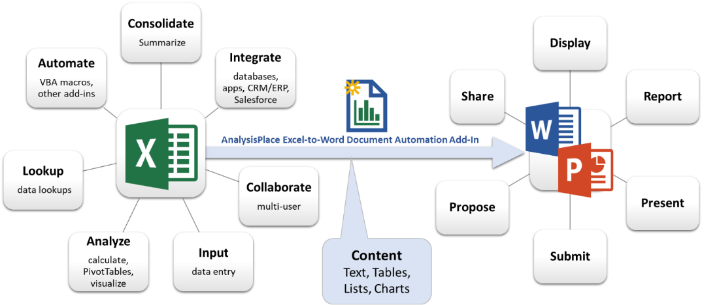

<p style="text-align:center"><em><span style="color:#5B9BD5; font-size:16pt">MyCustomer can realize $125,594 in benefits with an investment of only $25,324 -- that is an ROI of 396%.</span></em></p>

|  | One Time | Annual | Total |
| --- | --- | --- | --- |
| Costs | $9,550 | $3,155 | $25,324 |
| Benefits | $0 | $25,119 | $125,594 |
| Net Benefits |  |  | $100,270 |

| ​ | Income Statement ($Millions) |  |  |
| --- | --- | --- | --- |
| ​ | 2022 | 2021 | Change |
| Gross Sales | $10,000 | $9,500 | 5.3% |
| Returns | $513 | $487 | 5.3% |
| Net Sales | $9,487 | $9,013 | 5.3% |
| Cost of Goods Sold | $2,436 | $2,314 | 5.3% |
| Operating Expenses | $3,942 | $3,745 | 5.3% |
| Operating Profit | $3,109 | $2,954 | 5.3% |
| Interest and Other Income | $385 | $365 | 5.3% |
| Tax Expense | $513 | $487 | 5.3% |
| Net Profit | $2,981 | $2,832 | 5.3% |

```mermaid
xychart-beta
  title "Line Chart"
  x-axis ["2022", "2023", "2024", "2025"]
  y-axis "series1" 0 --> 100
  line [100, 80, 64, 51.2]
```

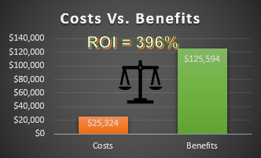


<span style="color:#7F7F7F; font-size:10pt">Customer XYZ will save $900,000.</span>

- Customer XYZ will save $900,000.

- Payment must be received by May 18, 2025.

- Customer will be happy.

1) Basic Features

1) Management Module

1) Implementation Services

1) Maintenance

1) Support Services

1. **Legal Details**

<span style="color:#7F7F7F; font-size:10pt">Lorem ipsum dolor sit amet, ei cum apeirian voluptaria. Lorem debitis liberavisse ex cum, fugit consulatu consequuntur eam eu. Te sea oratio utinam qualisque, inani numquam eruditi quo ei. Choro fierent cu eos, ex omnis eruditi nec. Graece consetetur consectetuer qui an.</span>

<span style="color:#7F7F7F; font-size:10pt">Ut ludus omittam mea, eu has harum cotidieque, te per libris minimum rationibus. Dolore vituperata honestatis vim ei, erat decore blandit ea usu. Vero invenire eos ne, duo ea oporteat scribentur, essent volutpat eum ei. Ex eos ceteros invenire, timeam omnesque constituam ut mea. Cum integre epicurei comprehensam et, an cum iudico nominati interesset. Cu nam sanctus laoreet, ad ignota tibique tacimates eum.</span>

<span style="color:#7F7F7F; font-size:10pt">Quas nonumes fuisset te pro, mei ad dolores vivendum, vim ei tantas dolorem. Id mentitum qualisque sit. Id mel quot delectus. Tibique perpetua vix te, vim assum senserit cu. At his quis sumo simul, apeirian forensibus eam ut. At sale repudiandae mel, vis cu ullum placerat iracundia. In vis quis labores apeirian, liber tempor qui cu, sea ut graeci instructior consectetuer.</span>

<span style="color:#7F7F7F; font-size:10pt">Ex ius posse vivendo. Ea per quod scripta. Lucilius lobortis ei quo, ei zril maiestatis percipitur vel. Iudico suscipit sit te, patrioque deseruisse mnesarchum pri no, sea cu movet labitur accusam. Est homero apeirian concludaturque et.</span>

|  | Column 1 | Column 2 |
| --- | --- | --- |
| Row 1 | 5/18/2025 23:34 | Red |
| Row 2 | $2.00 | Verdana Pro Font |

|  |  | Initial One-Time | Annual On-Going |  |  |  |  |  |
| --- | --- | --- | --- | --- | --- | --- | --- | --- |
| Description | Units | Qty | Cost Each | Total | Qty | Cost Each | Total | 3-Year Total |
| Product A User Licenses | Licenses | 95 | $200 | $19,000 | 95 | $50 | $4,750 | $33,250 |
| Product A Server Licenses | Server CPUs | 4 | $4,000 | $16,000 | 4 | $1,000 | $4,000 | $28,000 |
| Implementation Services | Person-days | 6 | $1,600 | $9,600 | 0 | $1,600 | $0 | $9,600 |
| Training Services | Days | 10 | $2,000 | $20,000 | 3 | $2,000 | $6,000 | $38,000 |
| Support Services | Incidents | 0 |  | $0 | 10 | $1,000 | $10,000 | $30,000 |
| Total |  |  |  | $64,600 |  |  | $24,750 | $138,850 |

| Merchant | Date | Category | Amount |
| --- | --- | --- | --- |
| The Phone Company | 5/18/2025 | Communications | $120.00 |
| Best For You Organics Company | 5/16/2025 | Groceries | $27.00 |
| Coho Vineyard | 5/15/2025 | Restaurant | $33.00 |
| Bellows College | 5/14/2025 | Education | $350.00 |
| Best For You Organics Company | 5/12/2025 | Groceries | $97.00 |

|  | 5/18/2025 | % of Revenue |
| --- | --- | --- |
| Total Revenue | $800,000,000 | 100% |
| Cost of Revenue | $440,000,000 | 55% |
| Gross Profit | $360,000,000 | 45% |
| Operating Expenses |  |  |
| Research and Development | $104,000,000 | 13% |
| Sales, General and Admin. | $160,000,000 | 20% |
| Non-Recurring Items | $16,000,000 | 2% |
| Other Operating Items | $8,000,000 | 1% |
| Operating Income | $72,000,000 | 9% |
| Add'l income/expense items | $8,000,000 | 1% |
| Earnings Before Interest and Tax | $80,000,000 | 10% |
| Interest Expense | $8,800,000 | 1% |
| Earnings Before Tax | $71,200,000 | 9% |
| Income Tax | $21,360,000 | 3% |
| Net Income | $49,840,000 | 6% |

| Income Statement | ​ | ​ |
| --- | --- | --- |
| US$000 | 2025 | 2024 |
|  | current year | prior year |
| Revenue | ​ | ​ |
| Gross sales | $10,000 | $9,500 |
| Less: sales returns | $385 | $365 |
| Less: Discounts and Allowances | $128 | $122 |
| Net Sales | $9,487 | $9,013 |
| ​ | ​ | ​ |
| Cost of Goods Sold | ​ | ​ |
| Goods manufactured: Raw materials | $1,026 | $974 |
| Goods manufactured: Direct Labor | $1,154 | $1,096 |
| Overhead | $256 | $244 |
| Total Cost of Goods Sold | $2,436 | $2,314 |
| Gross Profit (Loss) | $7,051 | $6,699 |
| ​ | ​ | ​ |
| Operating Expenses | ​ | ​ |
| Advertising | $1,282 | $1,218 |
| Delivery/Freight Expense | $64 | $61 |
| Depreciation | $13 | $12 |
| Insurance | $6 | $6 |
| Interest | $641 | $609 |
| Mileage | $128 | $122 |
| Office Supplies | $128 | $122 |
| Rent/Lease | $64 | $61 |
| Maintenance and Repairs | $192 | $183 |
| Travel | $128 | $122 |
| Utilities/Telephone Expenses | $1,026 | $974 |
| Wages | $256 | $244 |
| Other Expenses | $13 | $12 |
| Total Operating Expenses | $3,942 | $3,745 |
| Operating Profit (Loss) | $3,109 | $2,954 |
| Interest Income | $256 | $244 |
| Other Income | $128 | $122 |
| Profit (Loss) Before Taxes | $3,494 | $3,319 |
| Less: Tax Expense | $513 | $487 |
| Net Profit (Loss) | $2,981 | $2,832 |

| Sales Region | Quarter 1 | Quarter 2 | Quarter 3 | Quarter 4 | Growth |
| --- | --- | --- | --- | --- | --- |
| North | $4,500 | $4,400 | $4,900 | $5,200 | 16% |
| South | $6,500 | $6,400 | $6,000 | $5,900 | -9% |
| East | $6,100 | $6,000 | $6,100 | $6,200 | 2% |
| West | $5,000 | $5,500 | $6,500 | $7,200 | 44% |

| Section 1 | ​ |  |  |
| --- | --- | --- | --- |
| ​ | Section 1a | ​ |  |
| ​ | ​ | Content | data |
| ​ | ​ | Content | data |
| Section 2 | ​ |  |  |
| ​ | Section 2a | ​ |  |
| ​ | ​ | Content | data |
| ​ | ​ | Content | data |

| Formatted text (could be dynamic) | Text with Bold, Underlined, Red |
| --- | --- |
| Images (could select different images based on scenario/logic) | 0 |
| Conditional Formatting, HyperLinks, lists, and many other possibilities | Ordered List:CoffeeTeaMilkUnOrdered List:CoffeeTeaMilk |

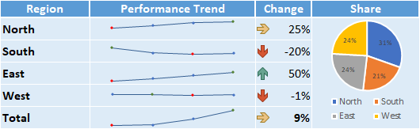

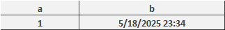


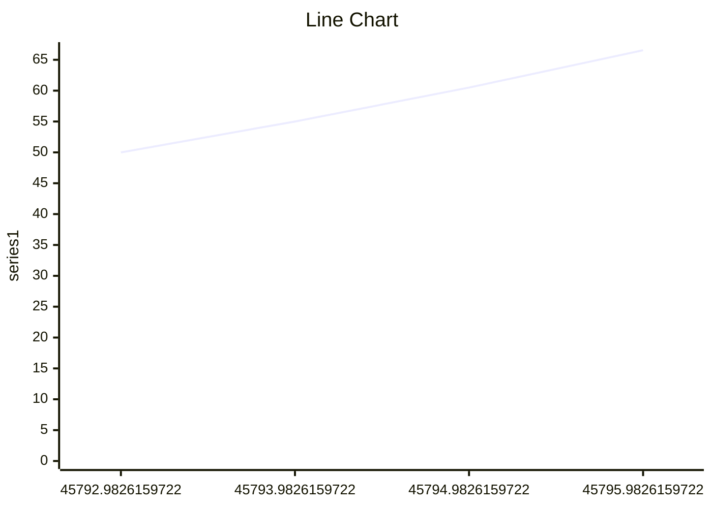

> 図形テキスト: 0
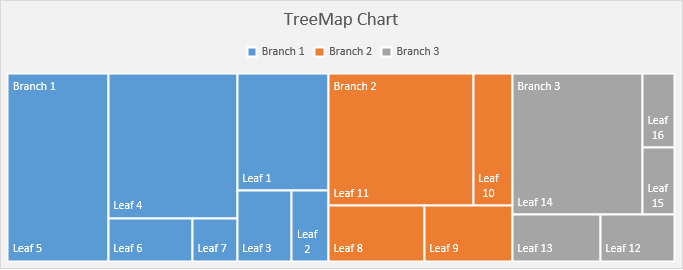

| Category | 2023 | 2024 | 2025 | Grand Total |
| --- | --- | --- | --- | --- |
| Accessories | ​ | 67800 | ​ | 67800 |
| Bikes | ​ | 6300 | ​ | 6300 |
| Clothing | 23700 | 2300 | 40000 | 66000 |
| Components | 2300 | 4100 | 25700 | 32100 |
| Grand Total | 26000 | 80500 | 65700 | 172200 |

| Category | 2023 | 2024 | 2025 | Grand Total |
| --- | --- | --- | --- | --- |
| Accessories |  | $67,800 |  | $67,800 |
| Bikes |  | $6,300 |  | $6,300 |
| Clothing | $23,700 | $2,300 | $40,000 | $66,000 |
| Components | $2,300 | $4,100 | $25,700 | $32,100 |
| Grand Total | $26,000 | $80,500 | $65,700 | $172,200 |

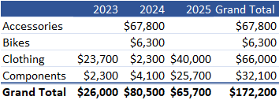

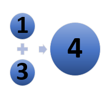


<span style="color:#7F7F7F; font-size:10pt">HTML formatting examples: </span><strong><span style="color:#7F7F7F; font-size:10pt">bold</span></strong><span style="color:#7F7F7F; font-size:10pt">; </span><span style="color:#FF0000; font-size:10pt">red</span><span style="color:#7F7F7F; font-size:10pt">.</span>

<span style="font-size:12pt">Table:</span>

| Month | Savings |
| --- | --- |
| January | $100 |
| February | $125 |

<span style="font-size:12pt">Ordered List:</span>

1. <span style="color:#7F7F7F; font-size:10pt">Coffee</span>

1. <span style="color:#7F7F7F; font-size:10pt">Tea</span>

1. <span style="color:#7F7F7F; font-size:10pt">Milk</span>

<span style="font-size:12pt">UnOrdered List:</span>

- <span style="color:#7F7F7F; font-size:10pt">Coffee</span>

- <span style="color:#7F7F7F; font-size:10pt">Tea</span>

- <span style="color:#7F7F7F; font-size:10pt">Milk</span>

### <strong><span style="color:#404040; font-size:16pt">AnalysisPlace</span></strong>


### <strong><span style="color:#404040; font-size:16pt">Ferrari 250 GTO</span></strong>


<span style="font-size:12pt">The Ferrari 250 GTO is a GT car produced by Ferrari from 1962 to 1964 for homologation into the FIA's Group 3 Grand Touring Car category. It was powered by Ferrari's Tipo 168/62 Colombo V12 engine.</span>

<span style="color:#1F4D78; font-size:12pt">SectionName</span>

<span style="color:#7F7F7F; font-size:10pt">	Section content</span>

<span style="color:#1F4D78; font-size:12pt">CostAnalysis</span>

<span style="color:#7F7F7F; font-size:10pt">	Section content</span>

<span style="color:#1F4D78; font-size:12pt">CaseStudyA</span>

<span style="color:#7F7F7F; font-size:10pt">	Section content</span>

<span style="color:#1F4D78; font-size:12pt">CaseStudyB</span>

<span style="color:#7F7F7F; font-size:10pt">	Section content</span>

<span style="color:#1F4D78; font-size:12pt">FinancialAnalysis</span>

<span style="color:#7F7F7F; font-size:10pt">	Section content</span>

<span style="color:#1F4D78; font-size:12pt">AppendixA</span>

<span style="color:#7F7F7F; font-size:10pt">	Section content</span>

<span style="color:#1F4D78; font-size:12pt">AppendixB</span>

<span style="color:#7F7F7F; font-size:10pt">	Section content</span>

| ​ | Column A | Column B | Column C | Column D | Column E | Column F |
| --- | --- | --- | --- | --- | --- | --- |
| Row 1 | r25c3 | r25c4 | r25c5 | r25c6 | r25c7 | r25c8 |
| Row 2 | r26c3 | r26c4 | r26c5 | r26c6 | r26c7 | r26c8 |
| Row 3 | r27c3 | r27c4 | r27c5 | r27c6 | r27c7 | r27c8 |
| Row 4 | r28c3 | r28c4 | r28c5 | r28c6 | r28c7 | r28c8 |
| Row 5 | r29c3 | r29c4 | r29c5 | r29c6 | r29c7 | r29c8 |
| Row 6 | r30c3 | r30c4 | r30c5 | r30c6 | r30c7 | r30c8 |
| Row 7 | r31c3 | r31c4 | r31c5 | r31c6 | r31c7 | r31c8 |
| Row 8 | r32c3 | r32c4 | r32c5 | r32c6 | r32c7 | r32c8 |
| Row 9 | r33c3 | r33c4 | r33c5 | r33c6 | r33c7 | r33c8 |
| Row 10 | r34c3 | r34c4 | r34c5 | r34c6 | r34c7 | r34c8 |
| Row 11 | r35c3 | r35c4 | r35c5 | r35c6 | r35c7 | r35c8 |
| Row 12 | r36c3 | r36c4 | r36c5 | r36c6 | r36c7 | r36c8 |
| Row 13 | r37c3 | r37c4 | r37c5 | r37c6 | r37c7 | r37c8 |
| Row 14 | r38c3 | r38c4 | r38c5 | r38c6 | r38c7 | r38c8 |
| Row 15 | r39c3 | r39c4 | r39c5 | r39c6 | r39c7 | r39c8 |

<strong><span style="color:#5B9BD5; font-size:12pt">Evaluación del valor empresarial de la solución</span></strong>

<span style="color:#7F7F7F; font-size:10pt">Basándonos en nuestro análisis, creemos que su empresa podría ahorrar 177.00 € millones comprando nuestra solución. Actuar hoy y se puede comprar por sólo 199.12 € Mil millones.</span>

| Section | Worksheets (Data Source) | Description |
| --- | --- | --- |
| Text, Lists, and Paragraphs | Text &amp; Lists | Excel-sourced text can be incorporated into documents in a variety of ways. This section shows how to: Add text to various document content types (titles, paragraphs, shapes, etc.)Incorporate/update data within textDynamically create lists and paragraphs (based on Excel formulas) |
| Tables | Tables | The add-in was designed to support a variety of table updating scenarios. This section describes/demos key table features:Source Excel data can be based on named ranges or tables (data tables)Table formatting set in Word/PowerPoint will not be modified after the updateSupports tables with merged cellsTables automatically resize to match source (Excel) table sizeTables can be configured to hide rows if hidden in Excel |
| Image of Ranges | Range Image | Transfers the image of the named range, just as it appears in Excel. The range can include SparkLines, product images, Maps, SmartArt, people photos, and Conditional Formatting in cells. |
| Charts | Charts | Updates charts based on data in an Excel range or table. Can update many large charts rapidly. |
| Chart Images | Chart Images | Essentially any chart type is supported and charts can contain a variety of added content (text, images, etc.) |
| PivotTables | Pivot | Excel PivotTables can update PowerPoint tables or can be transferred as an image |
| Shapes/Images | Shapes | Transfer any type of shape: text boxes, lines, geometric shapes, SmartArt, WordArt, pictures/photos, icons, maps, and equations. Shapes can contain dynamic content. |
| URL-Based Images | URL Img | Use image URLs to dynamically populate documents with product photos, logos, profile images, property photos, maps, and more. |
| HTML | HTML | Enables inserting HTML content into Word. Format text (bold, colors), add hyperlinks, insert images from URLs, etc. HTML can be created dynamically. |
| Layout Options | Misc | Dynamic content can be incorporated in a variety of ways (not just in-line), enabling great-looking documents/presentations.Content can also be updated in headers and footers (Word) and in PowerPoint master slides |
| Conditional Sections (Document Assembly) | Conditional Content | Describes how the add-in can include/exclude document sections, similar to "Document Assembly". Conditional Content automatically removes un-needed Word sections or PowerPoint slides. |
| Auto-Hide Rows/Columns | Auto-Hide | Automatically hides/unhides rows/columns based on cell value/formula when you click the "Auto-Hide Rows/Columns" button. |
| Mail Merge | Mail Merge | Shows how to quickly update multiple documents (one at a time) based on a table or database of information. Typically each row/record would contain data to update each document. |
| Localization – Currency | Currency | Shows how to change currency symbols and exchange rates in your Excel and destination documents |
| Localization - Language | Language | Shows how to switch languages. |
| Import Data (getting data into Excel) | Misc | Users commonly import data from external sources into Excel, so it can then be analyzed and updated in Word and PowerPoint documents. Common data sources include: web site data; databases; Azure; CRM/ERP systems, such as Salesforce; other Excel workbooks, web services, XML/JSON data, etc. |

| You can change the image size and resolution.  Higher resolution charts appear sharper in Word/PPT, but also increase transfer size and Word/PowerPoint file size.To Resize Chart Images: append your chart name with '_h' then the desired height in pixels or '_w' and the desired width in pixels. For example, 'r_Chart_w250' creates the image so it is 250 pixels wide (8.8 cm / 3.5 inches). The non-specified dimension scales so the aspect ratio remains the same.In Word, you can constrain the image size by placing the image within a container, such as a text box or a table with the cell Auto-Fit set to "Fixed Column Width". If you don’t constrain it, by default, its size in Word/PowerPoint will be the same as its size in Excel. The image above is within a text box to control the image size. | 0 |
| --- | --- |

| Based on our analysis, we believe Berkshire Hathaway could save $351 billion by purchasing our solution. Act today and you can purchase it for only $75 billion.Per EmployeeCompany Total (Billions)Our Savings $930  $350.6 Competitor Savings $300  $113.1 Solution Cost $200  $75.4 | 0 |
| --- | --- |

| Your net benefit is expected to be .211.67 €One TimeAnnual RecurringProject TotalTotal Investment94.07 €18.81 €188.15 €Total Benefits47.04 €70.56 €399.81 €Net Benefit211.67 € | 0 |
| --- | --- |

| Una vezRecurrente anualTotal del proyectoInversión total88.50 €17.70 €177.00 €Total de beneficios44.25 €66.37 €376.12 €Beneficio neto199.12 € | 0 |
| --- | --- |
