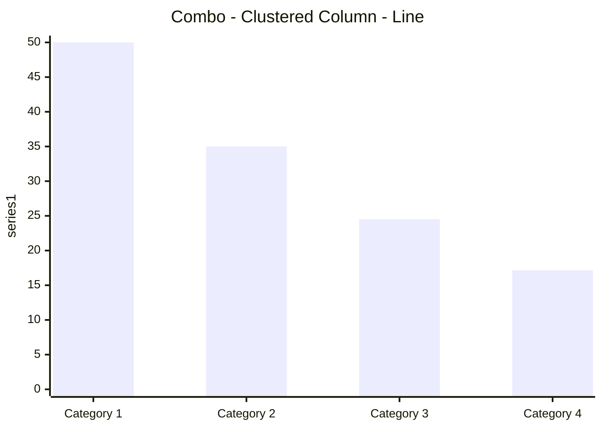
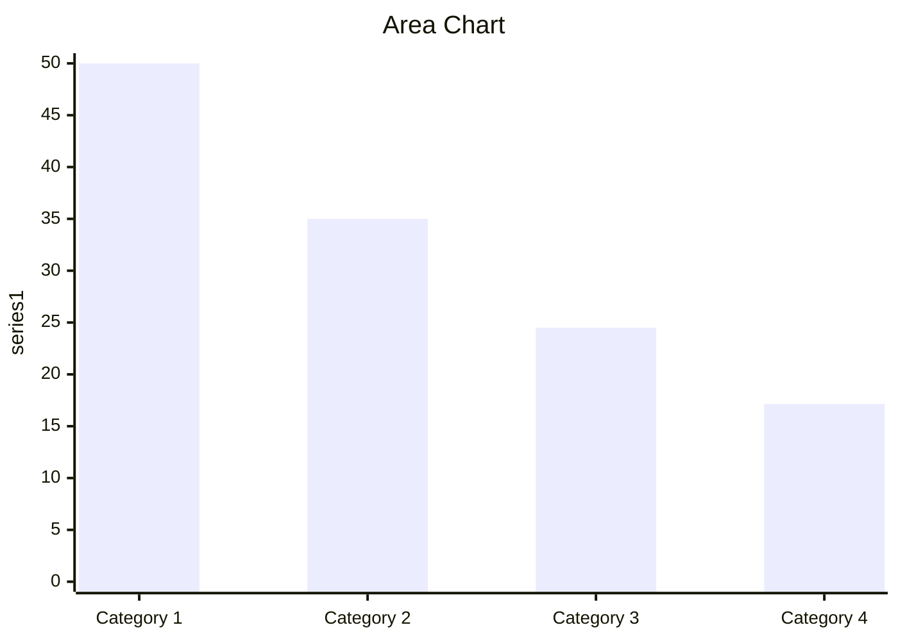
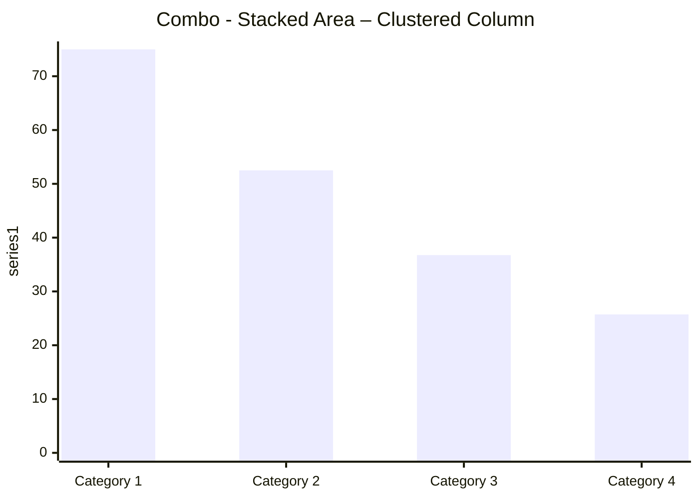
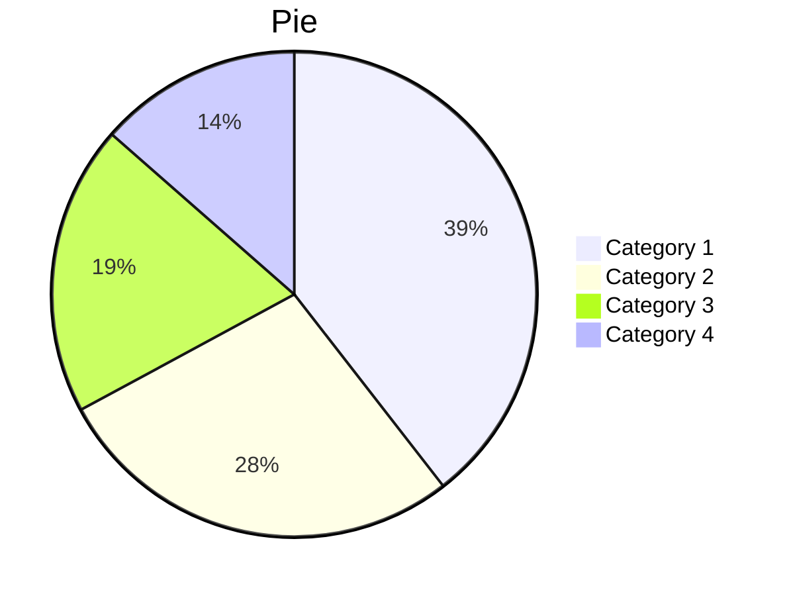
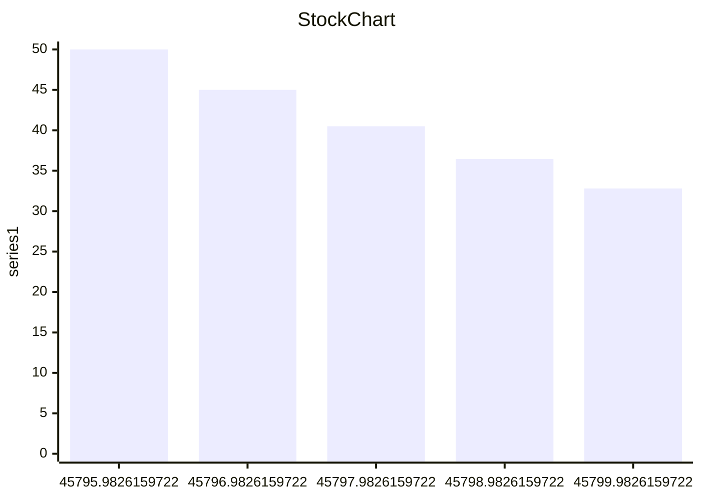

<strong>AnalysisPlacepreserve</strong>

<strong>Excel-to-WordpreserveDocument AutomationAdd-Inpreserve</strong>

Update/create Word and PowerPoint content (text, tables, and charts) based on Excel data and calculations.

# <strong>Sample Contentpreserveand How-To Guide</strong>

Thispreservedocumentpreservedemonstratespreservekeypreservecapabilitiesof tpreservehe add-in.preserveUseitpreservewithpreserve

Also seethepreserve<strong>preserve</strong>

<strong>To use this document:preserve</strong>

<strong>Inpreserve</strong><strong>Excel</strong><strong>:</strong>

Addthe add-in (Excel Ribbon Menu: Insert &gt; Get Add-ins)preserve, then activate itpreserve(right side of Home ribbon)

“Insert Sample Content” on the Start tab of the add-in

Make changes to any of the tan input cells in the workbook. Start with the QuickStart worksheetpreserve

“Submit Content” in the Excel add-in

<strong>Here Inpreserve</strong><strong>Word</strong><strong>:</strong>

If the add-in is not visible,preserveadd/activate it

“Update Document”, in the add-in in this document. You should be able to see the changespreservestarting on the next pagebased on your Excel modificationspreserve

If you are not already familiar with the basic features of the add-in, first seepreserve

<em>This document haspreserve“Auto-Open”enabledpreserve, meaning the add-in shouldpreserveautomaticallypreserveopen with the document. NormallypreserveAuto-OpenpreservecanonlypreservebepreserveenabledwithpreserveExcelpreserveworkbooks.</em>

## <strong>QuickStartpreserveSamplepreserveContent</strong>

<em>See Excel Worksheet</em><em><strong>:preserveQuickStart</strong></em>

The “dynamic” content in this section will be updated based on the data submitted from Excel when you click “Update Document” in the Update tab.

### <strong>Example Text</strong>

The text below is updated based on the Excel “r_TextSummary” range under the “Summary” heading:

Text links can also appear mixed in with other text:preserveis thepreservecustomername (preserveit’ssource is “preserver_CustomerName”).

### <strong>Example Tables</strong>

#### <strong>Destination Table</strong>

The table below is updated based on the “r_ROISumTable” range in Excel. It is a Destination-formatted table, so only the text/values will be updated – the format is set here in Word and won’t be modified by the update.

#### <strong>Flex Table</strong>

ThepreserveFlex Tablepreservebelow is based on the “r_ROISumTableFlex” range. It ispreserveExcel-formatted, so any changes in Excel (format or values) will be shown below after the update.

### <strong>Example Charts</strong>

Thischartpreserveispreserveupdated based on the Excelpreservetablepreservenamed “r_LineChart”:

Thischartpreserve(apreservepngimage)preserveis updated based on the Excel chart named “preserver_CostsVsBenefitsChart”:

### <strong>Example Shape</strong>

This image is based onpreservethepreserveshape named “r_ScrollShape”

## <strong>Table of Contents</strong>

## <strong>Text, Bullet Lists, and Paragraphs</strong>

<em>See Excel Worksheet</em><em><strong>: Text</strong></em>

Excel-sourced text can be incorporated into documents in a variety of ways.preserve

Single-cellpreservenamedpreserveranges update text items (e.g. titles, paragraphs, parts of text, lists) in Word/PowerPoint.

All linked contentpreservein Wordpreserveis included in Content Controls. You can hide the Content Controls (e.g. prior to sending to customers) by selecting “Hide” at the bottom of the “Link” tab in the add-in.

### <strong>Add Text to Various Document Content Types</strong>

Linked text can include or can be within: paragraphs, titles, text boxes, most shapes, WordArt, headers/footers, or a table cell. You can style the text as desired (colors, bold, font, etc.) and the style will remain after the update.preserve

preserveThis example shows the linkedpreservetext within a shape:

> 図形テキスト: 38100Customer XYZ

### <strong>CombiningpreserveText andpreserveDatapreserve</strong>

Data can easily be combined with text using the text() formulain Excelpreserve:

### <strong>Lists and Paragraphs</strong>

The add-in can create lists that change based on formulas in Excel.Lpreserveistpreservearebased formulapreservesin a single cell.preserve

Lists from Excel (a single link/control) can be styled as bullets or numbered lists.preserve

Alt-enter is typically used for manually created lists.

Char(10) is used if you want to list to change dynamically (part of a formula).

In cloud-created reports (PowerPoint or template-based Word reports), you can add multiple levels (indents) to your bullet lists by adding a greater-than symbol ">" to the start of the line in Excel. Add 2 ">>" for level 2 or  ">>>" for level 3 indents. These can be added dynamically to formulas.

This example shows a dynamically created(bpreserveased on anpreserveExcel formula)preserve<strong>bullet list</strong>:

In thisexample, the items arepreserveanpreserveautomaticallypreserve<strong>numberedlistpreserve</strong>:

This example shows dynamically created(Excel-sourced)preservepreserve<strong>paragraphs</strong>:

## <strong>Tables</strong>

<em>See Excel Worksheet</em><em><strong>:preserveTables</strong></em>

### <strong>Overview</strong>

The add-in was designed to update Word/PowerPoint tables for a variety of scenarios, including updating of large/complex tables, such as financial reports.preserve

The add-in allows you to update Word and PowerPoint tables in 3 ways: 1. Destination-formatted tables, 2. Excel-formatted (Flex) tables, and 3. Via an image of the source range/table.

See the “Tables” tab in the workbook for a detailed comparison

<em>See Excel Worksheet</em><em><strong>:preserveTables</strong></em>

This table will update based on changes made to the range name:preserver_TableComparison

## <strong>Destination-Formatted Tables</strong>

Formatting is applied in the destination (Word or PowerPoint) -- the update does not modify the table format, only the text/values

<em>See Excel Worksheet</em><em><strong>: Dest</strong></em>

### <strong>Named Ranges Vs. Data Tables</strong>

Source Excel data can be based onpreserve<strong>named ranges</strong>or tablespreserve(preserve<strong>data tables</strong>).They both can update Word/PowerPoint tablespreservethe same way.preserveThe firstpreserveand thirdpreservetablesbelowpreservearebased onpreservenamed ranges; the second is based on an Excel table.

### <strong>Create andpreserveFormatTablespreserve</strong>

In Word, you canlink tables in 3 wayspreserve(first Add-in &gt; Link &gt; “Get Excel Source Data” &gt;preserveSelect your table source from the drop-downs):

**Insert a new table**:preserve(preserveRibbon >preserveInsert > Tables > Table);preserveformat the table(preserveRibbon >preserveTable Tools > Design);preserveselect thepreserveentirepreservetableby clicking thepreserveicon above/left of the table;preservethenpreservelinkpreservethepreservetable(Add-preservein >preserveLink > “Insert Content / Update Link”).preserve

**Link an existing table**:preserveselect the entire table, then “Insert Content / Update Link“ button.preserveThe table should have the same number of rows/columns as the source Excelpreservetable/range.

**Insert and Link**:preserveput the cursor where you’d like the table, thenpreservesimplyclick the “preserveInsert Content / Update Link“ button.preserve

You can style tables (Table Styles, borders, font, colors, etc.) and the style will remain after the update (only the text will update).

### <strong>AutomaticpreserveTablepreserveResizing (Insert/Delete Rows/Columns)</strong>

The add-in will try to resize Word/PowerPoint tables to match the size of the source Excel table/range.preserveFor example, if the Excel table has 7 rows and the Word table has 4, the add-in will insert 3 rows.preserveThe next-to-the-last row/column will be used for the format template for the inserted rows/columns.

There are some limitations,preservefor example, the Word add-in cannot insert/delete columns if there are merged cells in the table.

### <strong>TableMerged Cellspreserve</strong>

The add-in supports most Word/PowerPoint table merged cell scenarios.The table belowpreservecontains 2 merged cell areas in the 1strow.preserve

If the add-in does not place content in the desired Word cell, try adding a space to the empty Excel cell to the left of the data that ends uppreservemisplaced.

### <strong>Hide Table Rows</strong>

To include visible rows/columns only: in Excel,preserveset Item Property "Include hidden rows &amp; columns" to 'No' orpreserveadd the suffix "_visible" (or "_vis")before the range or table namepreserve. Hidden, filtered, or grouped rows will not appear in your Word/PowerPoint table. Can be combined with _body.preserve

The table below demonstrates thispreserve–itpreserveonly includes visible rows in thepreservesource Excel table. The table is resizedpreserveto match thepreserveExcel tablepreservevisible row and column counts.

### <strong>Simple Financial Statement Example</strong>

This example demonstrates that the destination contentappearance can bepreserveverypreservedifferent from the source Excel format.

## <strong>Flex Tables(Excel-Formatted)preserve</strong>

FlexpreserveTables (including format) are created in Excel and replace the Word table during the update.

<em>See Excel Worksheet</em><em><strong>: Flex</strong></em>

Also see the<strong>preserve</strong>

### <strong>Income Statement Example</strong>

Flex tables can update many large tables in a document

### <strong>Table with Conditional Formatting</strong>

SupportedpreserveConditional Formattingformats: background color, font color, border color, bold, italics, and underlinepreserve

### <strong>Titles in Columns Example</strong>

### <strong>HTML in Cells</strong>

MostpreserveHTML/CSS can be included in Flex table cells.

## <strong>Image of Ranges</strong>

<em>See Excel Worksheet</em><em><strong>: Image</strong></em>

This feature transfers the image (PNG) of thepreservenamedpreserverange, just as it looks in Excel.

Name the cell or range of cells (starting with the prefix and ending with "_img").preserveInclude any content in the range (conditional formatting, sparklines, images, shapes, text boxes, smart art, dynamic items, etc.) The image (PNG) of all content in the range will be transferred to your Word/Ppt document just the way it appears in Excel.preserve

Large imagespreservesignificantly increase transfer size and will make the Word/PowerPoint file much larger.

### <strong>Image based on range containing a variety of formula-based elements</strong>

This example showssparklinespreserve, conditional formatting,preserveandpreservea chartin a range.preserveThpreservee source of the image below is a named range in Excel.

Border Issue Fix

Originalpreservepngimage (missing border):preserve

Fix applied (paste as linked picture)

## <strong>Charts</strong>

<em>See Excel Worksheet</em><em><strong>: Charts</strong></em>

Thepreservechartpreserveexamplespreservebelowpreservehave been linked to the table “r_CommonCharts”

preserve
> 図形テキスト: 0

preservepreserve

Thepreservechart examplepreservebelowpreservewith datepreservebaseditemspreservehas beenpreservelinked to the table “r_DateCharts”

preserveThepreservePiepreserveChart examplespreservebelowpreservehave been linked to the table “r_PieCharts”

preservepreserve

> 図形テキスト: 0

ThepreserveScatterpreserveChartpreserveexamplespreservebelowpreservehavepreservebeen linked to the tables“r_preserveScatter”and “r_Scatter2Series”preserve

preservepreserve
| chart | series | category | value |
| --- | --- | --- | --- |
| chart | series | category | value |
| --- | --- | --- | --- |

ThepreserveStock Chart examplepreservebelowpreservehas been linked to the table “r_StockChart”

The Sunburst Chart below has been linked to the table “r_Sunburst”

preserve

> 図形テキスト: 0

ThepreserveTreeMapChart below has been linked to the table “preserver_TreeMap”

## <strong>Chart/ GraphpreserveImagespreserve</strong>

<em>See Excel Worksheet</em><em><strong>: ChartpreserveImg</strong></em>

When charts are submitted, the chart image (PNG) will be transferred to your Word/PowerPointdocument.preserveSoformat thempreservein Excelpreservethe way you want them to look in your document.preserve

You can use essentially any type of chart/graph.

### <strong>Image Size, Quality, and Resolution</strong>

### <strong>Charts with Added Content</strong>

You can include other content to your charts, such as dynamic text, images, shapes,preserveetc.

Thispreservefeaturepreservecanpreserveenable very powerful/flexiblepreservecontentpreserveautomation capabilities.

The chart below containspreserveformula-based text and an image which will update based on the growth rate:

## <strong>PivotTables</strong>

<em>See Excel Worksheet</em><em><strong>: Pivot</strong></em>

Use Excel PivotTables for the source of tables (including images of tables)

### <strong>Flex Table(Excel Formatted)preserve</strong>

### <strong>Destination-formatted PivotTable</strong>

### <strong>Image of PivotTable</strong>

## <strong>ShapepreserveandpreserveImages</strong>

<em>See Excel Worksheet</em><em><strong>: Shapes</strong></em>

Transfer any type of shape to your Word/PPT document: text boxes, lines, geometric shapes, SmartArt, WordArt, pictures/photos, icons, maps, and equations. Shapes can contain dynamic content (based on a formula or using automation such as VBA macros or other add-ins).

Shapes with DatapreserverShapesWithData

rEquation

rPictureWithText

## <strong>Image updated based on user selection or cell formula</strong>

The example below displays a flag image based on a country that is selected based on a drop-down list in Excel. It shows an image which appears in a single cell in Excel. This technique is commonly used to display product images based on selected/configured solution or people photos.

Country Selected:preserve

<strong>Image in a Cell (Paste Picture in Cell)</strong>

Allows you to use formulas/logic to submit/update different pictures based on a configured scenario

r_SelectedPicture_img

<strong>Image Function</strong>

The =image() function can also insert an image based on a URL. It is not shown here because it requires a security approval in Excel.

Depending on your needs, there are also many ways to use VBA macros (and other add-ins) to modify the image displayed in the cell (which can be updated in Word/PowerPoint). Images could also be based on a URL from a remote web site.

## <strong>URL-Based Images</strong>

<em>See Excel Worksheet</em><em><strong>:preserveURLpreserveImg</strong></em>

Use image URLs to dynamically populate documents with product photos, logos, profile images, property photos, maps, and more.

### <strong>Image Appears in Excel</strong>

In these examples, the image appears in Excel,then the imagepreserveis transferred to Wordpreserveor PowerPointpreserve:

BasicpreserveExamplepreserve(shape name:preserver_CylinderShape):

Example Based on Excel Logic with Sizing(shape name:preserver_CylinderShape)

### <strong>Image AppearspreserveDirectlypreserveinpreserveWord or PowerPoint</strong>

In these examples, the image appearspreservedirectly inpreserveWordor PowerPointpreserve:

BasicpreserveExamplepreserve(rangepreservename:preserver_SphereShape_urlimg):

Example Based on Excel Logic with Sizing(preserverangepreservename:preserver_MyShape2_urlimg)

## <strong>HTML</strong>

<em>See Excel Worksheet</em><em><strong>: HTML</strong></em>

Thispreservefeaturepreserveenables extensive added formatting/content options, for example:preserve

Format text via header tags, like <h1>

Format content via the style= attribute. For example, change font size and color

Insert images from a URL via the  tag

Hyperlinks:<a> tagpreserve

Lists: <ol><li> and <ul> tag

Tables:<table> tagpreserve

Emphasize text via the <b>, <strong>, <u>, <i>, and <em> tags

The HTML content in the source Excel cell can be created via formula or programmatically (VBA macros, other add-ins, or external applications).

The name of the Excel cell must end with “_html” to insert the content as html.

Some html contentpreserveis not compatible: for example: &lt;/br&gt;,preservecssstylingpreserve

Note: when creatingpreservereports via Word Cloud (Enterprise Feature), image will not appear until thepreservetheopens the documpreserveent and clicks “Enable Editing”.

<strong>This example inserts text and a table with basic formatting:</strong>

<strong>This example insertslistspreserve:</strong>

<strong>This example insertspreservean image (a fantasticpreservecompany’spreservelogo) with a hyperlink:</strong>

<strong>This example dynamically (based ona user selection andpreserveExcelpreserveformulas)creates html withpreservea tipreservetle,an image,preservetext,preserveand a hyperlink:</strong>

## <strong>ConditionalpreserveContentpreserve(Document Assembly)</strong>

<em>See Excel Worksheet</em><em><strong>: Conditional Content</strong></em>

AnalysisPlacepreservecan notperform "Document Assembly" per say, but it can do the equivalent: It can automatically delete un-needed sections from the template.preserveSoinclude all needed content in your Word or PowerPoint templates, then configure your workbook to automatically indicate (e.g. based on formulas) which sections to delete, depending on the user scenario.preserve	

Common examples of “optional” content (which can be deleted based on the scenario):

Industry-specific case studies:  casestudies for all industries are included in the master Word/PowerPoint document, then all but the desired industry case study are deleted when the report is created/updated for a specific customer.preserve

Report (e.g. proposal) sections: all sections are included in the master document, then when the report is created/updated for a customer, unneeded sections are deleted.

In Excel, range names that start with “delete_” that contain value TRUE, determines which sections of created Word or PowerPoint reports will be deleted. Alternatively in Excel,preserveuse a"preserveReportSectionsToDelete" table.		

In Word,preservesee the “Conditional Content” section on the “link” tab of the add-in.preserveYou can create and list sections there. Sectionsare defined bypreserveContent Controls.preserve

The sections canbe nested.preserveSections can (and usually do) contain linked content.preserve

Conditional sections are highlighted in yellow (if “Show All” or “Show on Hover” are selected).

The sections below demonstrate how thispreservefeature works. Sections will be deleteddepending on thepreserveSecenarioselected in the “preserveSelect a Scenario”preserveinput cell in Excel.In the template, there are/werepreserve9sections below:preserve

## <strong>Auto-HidepreserveRows/Columns</strong>

<em>See Excel Worksheet:preserveAuto-Hide</em>

Automatically hides/unhides rows/columns based on cell value/formula when you click the "Auto-Hide Rows/Columns" buttoninpreservethepreserveExceladd-inpreserve.

This example is a Flex table.

## <strong>Mail Merge</strong>

<em>See Excel Worksheet:preserve</em><em><strong>Mail Merge</strong></em>

Mail merge is defined as:preservethe automatic addition of names and addresses from a database to letters and envelopespreservein order tofacilitate sending mail, especially advertising, to many addresses.preserve

Thepreserveadd-in was not designed for high-volume automated mailpreservemergeand it should not be used as a replacement for Word’s nativepreserve“Mailings” (Mail Merge) features.

The add-in can effectively be used to lookup recipient datafrom a list/tablepreserve,preservecalculate results, then updatepreserveWord/PowerPointpreservetemplates. This enables rapid creation of personalized data-intensive documentation.However, unlike Mail Merge, the documents must be updated one at a time.preserve

The example below looks uppreservecompany datapreservefrom an Exceltablepreservebased on a drop-down list, calculatesresults, then updates text,preservea table, and a chartin Word/PowerPointpreserve.preserveThis process would have to be repeated for each recipient.

## <strong>Localization(Currency and Language)preserve</strong>

It is often important to be able to easilypreservelocalize(currency and language)preservepreserveassessment tools and resultspreservedocuments. For example:

supporting users whopreserveare located indifferent regionspreserve

creating documents forcustomerspreservelocated inpreserveother countries

### <strong>Currency Switching(preservecurrency symbols and exchange rates)</strong>

<em>See Excel Worksheet:preserve</em><em><strong>Currency</strong></em>

This example shows how topreservechangecurrency symbols and exchange ratespreservepreserve(via a drop-down selection)preservein yourpreserveExcel and destination documents.

### <strong>Language Switching</strong>

<em>See Excel Worksheet:preserve</em><em><strong>Language</strong></em>

Theexamplepreservebelowpreserveshows how topreservechangepreservelanguage(via a drop-down selection)preservepreservein yourpreserveExcel and destination documents.It also changes currency.preserve

Oftenpreserveorganizationshave a destination documentpreservetemplatepreservefor each language andpreservea single Excelpreserveworkbookpreserveis used topreserveupdate the dynamic contentpreservein the destination documents.preserve

This is often combined with the Excel table “Disable Cell Updates” feature. Table row/column header text is left unchanged in each document (which are in different languages) and only the cells with data are updated. This avoids the need to transfer the text (in each language) from Excel to the Word/PowerPoint tables.preserve

Thepreserve“Cloud Reporting” in thepreserveEnterprisepreserveversionpreserveis also very helpful with this scenario: the user selects thepreserveregion (currency/language)in an Excel drop-down,preservecompletes their assessment, then simply selects thepreservedesired reportpreservetemplate (there would be one for each language)preservefrom apreservedrop-down in the add-in and they download the personalized report inthe customer’s preferred language/currency.preserve

## <strong>Layout Options</strong>

Dynamic content can be incorporated in a variety of ways (not just in-line) enabling great-looking documents/presentations.

### <strong>Word</strong>
> 図形テキスト: 0MerchantDateCategoryAmountThe Phone Company5/18/2025Communications$120.00Best For You Organics Company5/16/2025Groceries$27.00Coho Vineyard5/15/2025Restaurant$33.00Bellows College5/14/2025Education$350.00Best For You Organics Company5/12/2025Groceries$97.00

The content controls can be placed in-line with text (the default) or you can insert the controls within containers, such as text boxes, and these containers can be placed anywhere (not just in-line with text). This enables very powerful/flexible layout options, such as updatable dashboards,infographicspreserve, and great-looking personalized branded marketing/sales material.

In the example to the right, a table is placed inside a text box and the text box wrapping style is set to square.

### <strong>PowerPoint</strong>

All PowerPoint content is shape-based. Shapes can be titles, text boxes, tables, images, etc. Shapes are tagged (with the link code in the shape’s alt-text property) and updated by the add-in. Shapes can be placed anywhere on a slide (including overlapping). A slide can contain many shapes. Slides and shapes can be copied/pasted and will retain their links.

### <strong>Headers, Footers, and MasterSlidespreserve</strong>

In Word, linked text can be placed in headers and footers.

In PowerPoint, master slides can contain linked content.

## <strong>Import Data -preserveImporting external data intopreserveExcel</strong>

Users commonly importpreservedatapreservefrompreserveexternalpreservesources intopreserveExcel, so itpreservecan then bepreserveconsolidated/analyzedinpreserveExcelandpreservepreservethenpreserveupdatedpreserveinpreserveWord and PowerPoint documents.preserveCommon data sources include: web site data; databases; Azure; CRM/ERP systems, such as Salesforce; other Excel workbooks, web services, XML/JSON data, etc.preserve

Here are a fewpreserveMicrosoftpreserveresources that may bepreservehelpful:

(preserveUse Excel's Get & Transform (Power Query) experience to import data into Excel from a wide variety of data sources. You can then use the Query Editor to edit query steps to shape or transform data.)

preserveGet & Transform enables you to connect, combine, and refine data sources to meet your analysis needs.

preserveThis reference article discusses importing and connecting data. You will learn about tasks like importing, updating, securing, and managing data.

Most major software/appvendors providepreserveways for userstopreservesecurelypreserveimport data into Excel. There are also many 3rd-party solutions,preserveincluding otheradd-inspreserve,to help connectpreserveExcelpreservetopreserveappsand other data sourcespreserve.Microsoft’spreservePower BIis also commonly used to import and analyzepreserveenterprise data.

The Enterprise version also contains apreserve“Data Refresh” feature that can automatically update frequentlypreserveupdated data (such as pricing and exchange rate data) every time the workbook is opened.

| Section | Worksheetspreserve(Data Source) | Description |
| --- | --- | --- |
| Text,preserveLists,and Paragraphspreserve | Text &preserveLists | Excel-sourced textpreservecan bepreserveincorporated intopreservedocuments in a variety of ways. This section shows how to:preserveAdd text to various document content types(titles, paragraphs, shapes, etc.)preserveIncorporate/updatedata within textpreserveDynamicallypreservecreate lists and paragraphs(bpreserveased onpreserveExcel formulas) |
| Tables | Tables | The add-in was designed to support a variety of table updating scenarios. This section describes/demospreservekey table features:Source Excel data can be based onpreservenamed ranges or tables(data tables)preserveTable formattingset in Word/PowerPoint will not be modified after the updatepreserveSupports tables withpreservemerged cellsTablespreserveautomatically resizeto match source (Excel) table sizepreserveTables can be configured topreservehide rowsif hidden in Excelpreserve |
| Image of Ranges | Range Image | Transfers the image of the named range, just as it appears in Excel.preserveThe range canincludepreserveSparkLines,preserveproduct images, Maps,preserveSmartArt,preservepeoplepreservephotos,preserveandpreserveConditional Formattingin cellspreserve. |
| Charts | Charts | Updates charts based on data in an Excel range or table. Can updatepreservemanylarge charts rapidly.preserve |
| ChartpreserveImages | ChartImagespreserve | Essentially any chart type ispreservesupportedandpreservecharts can contain a variety ofpreserveaddedpreservecontent(text, images, etc.)preserve |
| PivotTables | Pivot | Excel PivotTables can update PowerPoint tables or can be transferred as an image |
| Shapes/Images | Shapes | Transfer any type of shape: text boxes, lines, geometric shapes, SmartArt, WordArt, pictures/photos, icons, maps, and equations. Shapes can contain dynamic content. |
| URL-Based Images | URLpreserveImg | Use image URLs to dynamically populate documents with product photos, logos, profile images, property photos, maps, and more. |
| HTML | HTML | Enables inserting HTML content into Word. Format text (bold, colors), add hyperlinks, insert images from URLs, etc. HTML can be created dynamically. |
| Layout Options | Misc | Dynamic content can be incorporated in a variety of ways(not just in-line)preserve,enablingpreservegreat-looking documents/presentations.Contentcanpreservealsopreservebe updated in headers and footers (Word)and inpreservePowerPoint master slides |
| Conditional Sections (Document Assembly) | ConditionalpreserveContent | Describes how the add-in can include/exclude document sections,preservesimilar to"Document Assembly". ConditionalpreserveContentpreserveautomatically removes un-needed Word sections or PowerPoint slides. |
| Auto-Hide Rows/Columns | Auto-Hide | Automatically hides/unhides rows/columns based on cell value/formula when you click the "Auto-Hide Rows/Columns" button. |
| Mail Merge | Mail Merge | Shows howpreservetopreservequicklypreserveupdatepreservemultiple documents(one at a time)preservebased on a table or databasepreserveofpreserveinformationpreserve.preserveTypicallyeach row/record would contain data to updatepreserveeach document.preserve |
| Localization– Currencypreserve | Currency | Shows how topreservechangecurrency symbols and exchange ratespreservein yourpreserveExcel and destination documentspreserve |
| Localization -preserveLanguage | Language | Shows how to switch languages.preserve |
| Import Datapreserve(gettingdata into Excel)preserve | Misc | Users commonly importpreservedatapreservefrompreserveexternalpreservesourcespreserveintopreserveExcel, so itpreservecan then beanalyzed andpreserveupdatedpreserveinpreserveWord and PowerPoint documents.preserveCommon data sourcespreserveinclude:web site datapreserve;databasespreserve;preserveAzure;preserveCRM/ERP systems, such as Salesforce; other Excel workbooks,preserveweb services,preserveXML/JSONdata, etc.preservepreserve |

| You can change the image size and resolution.  Higher resolution charts appear sharper in Word/PPT, but also increase transfer size and Word/PowerPoint file size.To Resize Chart Images: append your chart name with '_h' then the desired height in pixels or '_w' and the desired width in pixels. For example, 'r_Chart_w250' creates the image so it is 250 pixels wide (8.8 cm / 3.5 inches). The non-specified dimension scales so the aspect ratio remains the same.In Word, you can constrainpreservethepreserveimage size by placing the image within a container, such as a text box or a table with the cell Auto-Fit set to "Fixed Column Width".preserveIf you don’t constrain it, by default, its size in Word/PowerPoint will be the same as its size in Excel. The image above is within a text box to control the image size. | 0 |
| --- | --- |

| Based on our analysis, we believe Berkshire Hathaway could save $351 billion by purchasing our solution. Act today and you can purchase it for only $75 billion.Per EmployeeCompany Total (Billions)Our Savings$930preserve$350.6preserveCompetitor Savings$300preserve$113.1preserveSolution Cost$200preserve$75.4preserve | 0 |
| --- | --- |

| Your net benefit is expected to bepreserve.211.67 €One TimeAnnual RecurringProject TotalTotal Investment94.07 €18.81 €188.15 €Total Benefits47.04 €70.56 €399.81 €Net Benefit211.67 € | 0 |
| --- | --- |

| UnapreservevezRecurrentepreserveanualTotal delpreserveproyectoInversióntotalpreserve88.50 €17.70 €177.00 €Total depreservebeneficios44.25 €66.37 €376.12 €Beneficiopreserveneto199.12 € | 0 |
| --- | --- |
