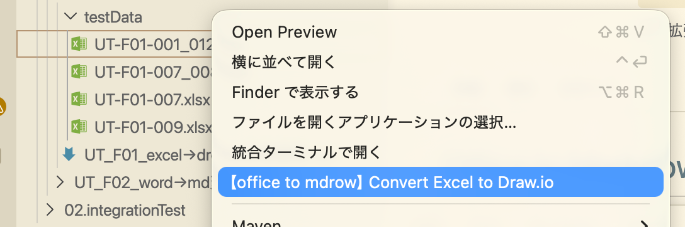
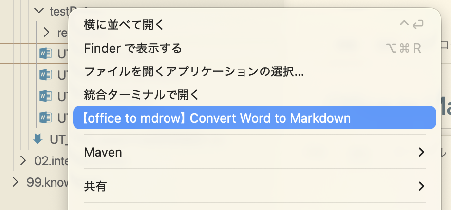
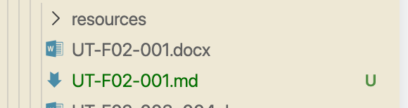

# office to mdraw

Convert Microsoft Office files from the VS Code Explorer context menu.

The extension currently converts Excel and Word files into editable text-based formats. Conversion runs locally and writes the generated file next to the selected Office file.

## Supported Conversions

| Input | Output | Status |
|---|---|---|
| `.xlsx` | `.drawio` | Supported |
| `.docx` | `.md` and `resources/` | Supported |
| `.pptx` | Marp Markdown | Not implemented yet. Planned for a future release. |

## How to Use

1. Open a folder in VS Code.
2. Right-click an Office file in the Explorer.
3. Select one of the conversion commands:

   - `Convert Excel to Draw.io`

     

   - `Convert Word to Markdown`

     

4. The converted file is created in the same folder as the source file.

   Excel to Draw.io result:

   

   Word to Markdown result:

   

## Conversion Details

### Excel to Draw.io

- Reads `.xlsx` files as Office Open XML.
- Converts sheets into Draw.io pages.
- Converts cell text, basic tables, shapes, connectors, and embedded images.
- Embeds Excel images as base64 data URIs inside the Draw.io XML.
- Outputs a `.drawio` file next to the source workbook.

### Word to Markdown

- Reads `.docx` files as Office Open XML.
- Converts headings, paragraphs, tables, images, and simple shape text.
- Exports Word images into a `resources/` folder.
- References images from Markdown using relative paths.
- Outputs a `.md` file next to the source document.

### PowerPoint to Marp

PowerPoint `.pptx` to Marp Markdown conversion is not implemented yet. It is planned as a future enhancement.

## Requirements

No Python installation is required. The conversion logic is implemented in TypeScript and runs inside the VS Code extension environment.

## Data Usage

- All conversion runs locally on your machine.
- Selected Office file contents are used only to generate the converted output.
- This extension does not upload Office files or conversion results to any external server.

## Output Policy

- Intermediate JSON is not kept as a final output.
- Word images are written to `resources/`.
- Excel images are embedded in the Draw.io XML.
